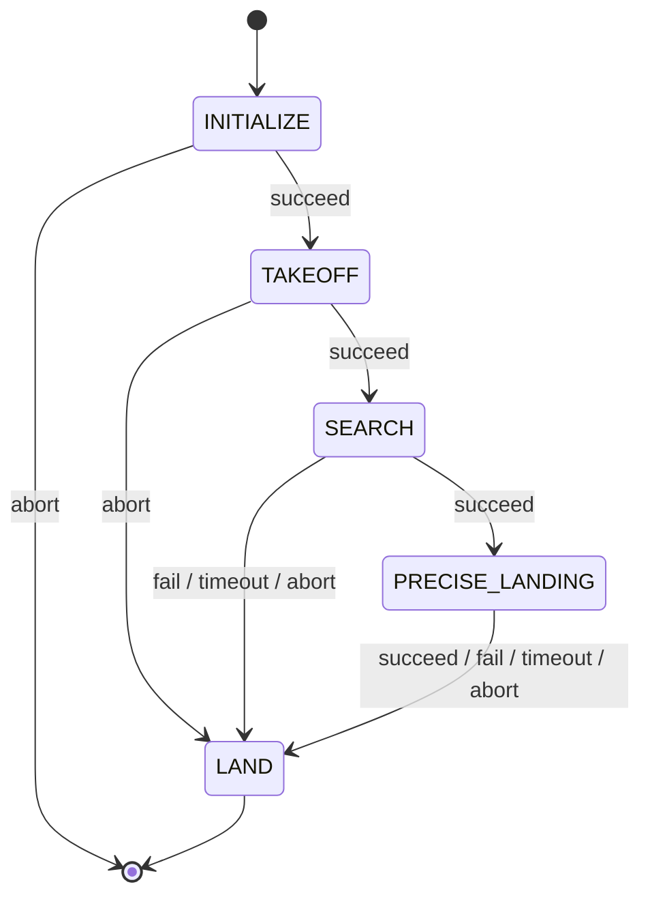

# Bouncing — SAE EletroQuad 2026 Mission 1

ROS 2 package for **Bouncing 2.0**. Landing pads are marked by a geometric figure plus a number. The drone reads the takeoff marker (ArUco + shape), finds the pad with the same pair, and lands with the gear inside that figure.

Built on [Nectar SDK](https://github.com/Black-Bee-Drones/nectar-sdk) (`MavrosDrone`, `Detector`, `ImageHandler`, PID) and [Yasmin](https://github.com/uleroboticsgroup/yasmin).

## Hardware

- ArduPilot via MAVROS (`MavrosConfig()` default).
- Down camera: OpenCV webcam, 1280×720, device 0 ([`constants.py`](bouncing/constants.py)).
- Pixel to meter in search/landing uses FOV 86° (width) and 47° (height).

No Gazebo world in this package.

## Strategy

1. **Takeoff marker** — Detector class `6` (ArUco). Decode `DICT_5X5_*`; the id modulo 3 / 4 / 5 is the number. The overlapping shape class `0` hexagon, `1` star, or `2` triangle is the figure. Together they are `target_base`.
2. **Search** — Climb to 6 m (`vz=0.5`). At that altitude take 20 photos per waypoint, then `move_to` the next relative point: `(0,0) → (3.5,0) → (0,0) → (−3.5,0)`, cycling. Abort if altitude ≥ 7 m or 180 s timeout. Succeed after 4 consecutive frames that show a pad with the same number+shape (shapes covering ≥ 60% of the image are ignored).
3. **Precise landing** — PID on the pad centroid vs image center. Descend (`error_z = altitude − 0.7`) only when the pixel error is ≤ 200 px. Succeed after 5 ticks with lateral error ≤ 0.40 m and altitude ≤ 1.1 m.

Class `3` on the detector is a crop handed to `best_classifier.pt` (numbers 3/4/5 and ArUco).

## State machine

[`mangalarga.py`](bouncing/mangalarga.py):



[`pid_machine.py`](bouncing/pid_machine.py) skips SEARCH and seeds `target_base = {shape: '0', number: '5'}` (hexagon, number 5). Comment in that file: star `1`, triangle `2`.

| State | File | Role |
|---|---|---|
| INITIALIZE | [initialize.py](bouncing/states/initialize.py) | `MavrosDrone`, YOLO detector + classifier, webcam. Saves `bouncing-YYYY-MM-DD-HH-MM/{images,annotated}` |
| TAKEOFF | [takeoff.py](bouncing/states/takeoff.py) | `takeoff(1.0 m, adjust_altitude=False)` |
| SEARCH | [search.py](bouncing/states/search.py) | Climb, waypoint photos, lock `target_base`, find matching pad |
| PRECISE_LANDING | [precise_landing.py](bouncing/states/precise_landing.py) | Metric PID xy/z; lost detections climb at 0.1 m/s if still below 6 m |
| LAND | [land.py](bouncing/states/land.py) | `drone.land()` |

## Main configs

[`bouncing/constants.py`](bouncing/constants.py):

| Name | Value |
|---|---|
| `TAKEOFF_ALTITUDE` | 1.0 m |
| `SEARCH_TARGET_ALTITUDE` | 6.0 m (fail at 7.0 m) |
| `SEARCH_TIMEOUT` | 180 s |
| `SEARCH_PHOTOS_PER_POINT` | 20 |
| `SEARCH_FIND_TOLERANCE` | 4 frames |
| `PRECISE_LAND_ALTITUDE` | 1.1 m |
| `PRECISE_ALING_TOLERANCE` | 0.40 m |
| `PRECISE_DOWN_TOLERANCE_PX` | 200 px |
| `PRECISE_HOVER_COUNT` | 5 |
| `PRECISE_TIMEOUT` | 240 s |
| Detector / classifier conf | 0.5 / 0.5 |
| PID xy | Kp 0.4, output ±0.22 m/s |
| PID z | Kp 0.20, output ±0.8 m/s |

## Models

Installed from `share/models/` via `get_package_share_directory("bouncing")`. Code paths:

- `best_detector_5_class.pt` — live detector. States filter shapes `0` / `1` / `2`, crop class `3` into the classifier, ArUco class `6`, and (unused helper) start base `7`.
- `best_classifier.pt` — crop of detector class `3` → number 3 / 4 / 5 / ArUco.
- `best_7_class.pt` and `best_detector_4_class.pt` are on disk; they are not `MODEL_DETECTOR_SOURCE`.

Class tables in [share/models/README.md](share/models/README.md) describe `best_detector.pt` (that filename is not on disk) and `best_7_class.pt`. No Hugging Face URLs in this package.

## Run

```bash
cd ~/ros2_ws
colcon build --packages-select bouncing
source install/setup.bash

ros2 run bouncing mangalarga      # SEARCH + precise land
ros2 run bouncing pid_machine     # skip search; hexagon / 5
ros2 run bouncing view_camera     # `-p use_compression:=true` (default), topics `image_raw/compressed` or `image_raw`
```

Webcam helper (not a ROS entry point): [`bouncing/utils/reset_webcam.bash`](bouncing/utils/reset_webcam.bash) (`/dev/video0`).

## Dependencies

Code imports `rclpy`, `nectar`, `yasmin`, `ultralytics`, OpenCV. [`package.xml`](package.xml) currently declares only the ament test deps.
