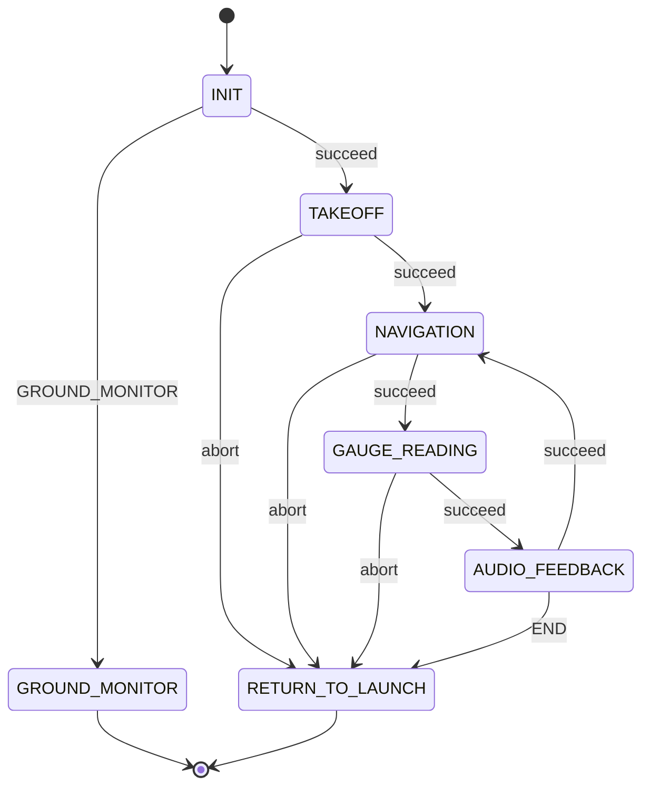

# Faulty or Not — SAE EletroQuad 2026 Mission 3

ROS 2 package for **Faulty or Not**. The drone visits three analog manometers, classifies the needle, and a ground station compares that reading to the expected pressure. Above expected is faulty.

This mission uses **zaxis** (`Drone` over MAVLink), not Nectar `MavrosDrone`. Gauge models go through `nectar.ai` `UltralyticsModel`. The state machine is [Yasmin](https://github.com/uleroboticsgroup/yasmin).

## Hardware

- zaxis MAVLink: `udpin:0.0.0.0:14550`, baud 921600, mode GUIDED.
- V4L2 camera device `0`. Sim mode subscribes to `/downward_camera/image_raw` instead.
- Optional TFLuna on `/dev/ttyUSB0` via `ros2 run faulty_or_not rangefinder_node` (MAVLink `127.0.0.1:14551`, obstacle height 1.7 m).
- Gauge approach uses `drone.distance_sensor.current_distance`. Manometer plane 1.7 m, approach altitude 2.7 m.

No Gazebo world in this package.

## Strategy

Two processes share DDS:

1. **Air** — `ros2 run faulty_or_not faulty_or_not`, INIT menu **Run Mission**. Takeoff 2.5 m, `goto_local` each waypoint (`face_wp=True`, radius 0.2 m, timeout 20 s), center on the manometer with the coarse detector, classify, pack the result, wait for ACK, next waypoint or RTL.
2. **Ground Monitor** — a second process, INIT menu **Run Ground Monitor**. Operator sets expected psi per waypoint (`0, 20, 40, 60, 80, 100, 120`). Class 0–5 maps to 20, 40, 60, 80, 100, 120 psi. **Faulty if actual > expected.** Plays [`assets/alarm.mp3`](faulty_or_not/assets/alarm.mp3) or [`assets/not_faulty.mp3`](faulty_or_not/assets/not_faulty.mp3).

Handshake: `/gauge/reading` `UInt8` packed as `(gauge_class << 5) | (waypoint_index & 0x1F)`. Ground Monitor ACKs `/gauge/ack` with the waypoint index. Retransmit every 0.5 s, timeout 25 s. First waypoint waits up to 20 s for a subscriber.

INIT can also **Edit Coordinates** (`~/.faulty_or_not_mission_coords.json`) and **Toggle Simulation Mode**. Ground Monitor waypoints persist in `~/.faulty_or_not_waypoints.json`.

## State machine

[`sm.py`](faulty_or_not/sm.py):



KeyboardInterrupt in `main()` calls `drone.land()`.

| State | File | Role |
|---|---|---|
| INIT | [init.py](faulty_or_not/states/init.py) | TUI, coords, sim camera thread, connect zaxis |
| TAKEOFF | [takeoff.py](faulty_or_not/states/takeoff.py) | Arm, capture origin, takeoff 2.5 m (timeout 20 s) |
| NAVIGATION | [navigation.py](faulty_or_not/states/navigation.py) | `goto_local` to `locations[control_index]` |
| GAUGE_READING | [gauge_reading.py](faulty_or_not/states/gauge_reading.py) | Coarse bbox P control, then classify. Always SUCCEED (`gauge_reading = −1` if none). JPEG on `/gauge/compressed`, saves `~/faulty_inferences` |
| AUDIO_FEEDBACK | [audio_feedback.py](faulty_or_not/states/audio_feedback.py) | Pack, handshake, increment index; last WP → `END`. Saves `~/faulty_images/detection_waypoint_{i}.jpg` |
| RETURN_TO_LAUNCH | [return_to_launch.py](faulty_or_not/states/return_to_launch.py) | `drone.rtl().wait(timeout=30)` |
| GROUND_MONITOR | [ground_monitor.py](faulty_or_not/states/ground_monitor.py) | Expected psi, compare, audio |

## Main configs

[`parameters.py`](faulty_or_not/parameters.py) and constants in `gauge_reading.py`:

| Name | Value |
|---|---|
| `LOCATIONS` | `(-5, −1.5, −6.5)`, `(0, 1.5, −6.5)`, `(4, −2, −6.5)` |
| `TAKEOFF_ALTITUDE` | 2.5 m |
| `MANOMETER_HEIGHT_M` | 1.7 m |
| `APPROACH_ALTITUDE_M` | 2.7 m |
| `DEVICE` | 0 |
| Coarse / class conf | 0.5 / 0.5 |
| Center PID | Kp 0.4–1.2 (bbox scaled), max vel 0.2 m/s, Kp_z 0.15 |
| Centered | 3 consecutive frames, max 15 s |

## Models

Installed from `faulty_or_not/models/`:

| File | Role |
|---|---|
| `coarse.pt` | Manometer bbox |
| `best.pt` | Needle class 0–5 |

## Run

```bash
cd ~/ros2_ws
colcon build --packages-select faulty_or_not
source install/setup.bash
```

Two terminals for a scored run:

```bash
ros2 run faulty_or_not faulty_or_not    # Ground Monitor
ros2 run faulty_or_not faulty_or_not    # Run Mission
```

```bash
ros2 run faulty_or_not rangefinder_node
ros2 run faulty_or_not test_cam              # webcam → /gauge/compressed
ros2 run faulty_or_not test_gauge_publisher  # random packed UInt8 on /gauge/reading
```

`simtools` only constructs the `/downward_camera/image_raw` subscriber.

## Dependencies

Code uses `rclpy`, `yasmin`, `zaxis`, `nectar.ai`, `cv_bridge`, `playsound`, OpenCV, `v4l2-ctl`. [`package.xml`](package.xml) currently declares `rclpy` plus ament tests.
