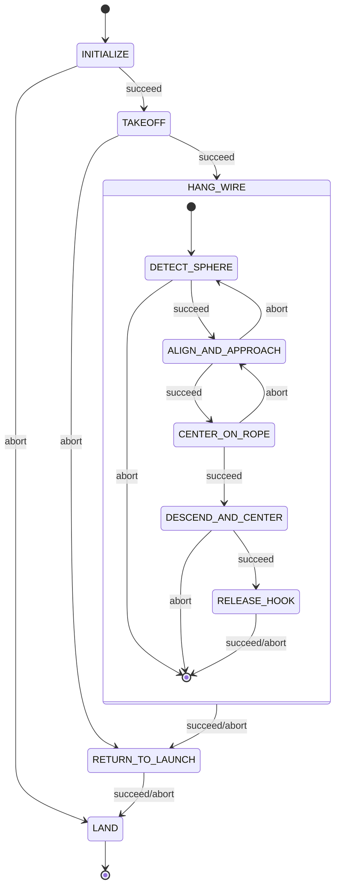

# Hook - SAE Eletroquad 2026 Mission 2

ROS 2 package for the "Hang the Right Wire" mission. The drone takes off from the center of a 7m-diameter arena, identifies which of two ropes has the orange sphere, flies to that rope, hangs a hook via servo, and returns to land.

Built with [Nectar SDK](https://github.com/Black-Bee-Drones/nectar-sdk) and [Yasmin](https://github.com/uleroboticsgroup/yasmin) state machines.

## Hardware

- **Drone**: Custom quadrotor with ArduPilot (GPS-based pose)
- **Camera**: Arducam 2MP IMX662 Ultra Low Light USB (102deg diagonal FOV, 1920x1080)
- **Compute**: Jetson Orin Nano
- **Hook mechanism**: Servo motor (AUX 3)

## Strategy

1. Take off to 6m -- the camera FOV covers the full arena from that altitude
2. Detect the orange sphere (25cm, YOLO detection model) to identify the correct rope
3. Align yaw toward the sphere, then approach using sphere detection for coarse centering
4. Fine center on the rope using segmentation model (YOLO-seg) + PID
5. Descend while maintaining segmentation-based centering until release altitude (2.0m)
6. Release hook via servo, RTL, land

## State Machine



### States

| State | File | Description |
|-------|------|-------------|
| INITIALIZE | `core/states.py` | Create drone (DroneFactory/MAVROS), camera (ImageHandler/USB), load detection + segmentation models |
| TAKEOFF | `core/states.py` | Arm, set home, take off to search altitude (6m) |
| DETECT_SPHERE | `states/detect_sphere.py` | Detect orange sphere from altitude with yaw scan if needed |
| ALIGN_AND_APPROACH | `states/align_and_approach.py` | Yaw alignment toward sphere, then forward approach with lateral correction |
| CENTER_ON_ROPE | `states/center_on_rope.py` | Segmentation-based PID centering on rope mask centroid |
| DESCEND_AND_CENTER | `states/descend.py` | Descend at constant rate while maintaining centering via segmentation + PID |
| RELEASE_HOOK | `states/release_hook.py` | Servo actuation to release hook |
| RETURN_TO_LAUNCH | `core/states.py` | Navigate back to takeoff position |
| LAND | `core/states.py` | Land and cleanup |

## Package Structure

```
hook/
  hook/
    mangalarga.py           # Top-level state machine + entry point
    core/
      constants.py          # All tunable parameters
      states.py             # Initialize, Takeoff, ReturnToLaunch, Land
    states/
      sm.py                 # HangWireSM sub-state machine
      detect_sphere.py
      align_and_approach.py
      center_on_rope.py
      descend.py
      release_hook.py
  share/models/             # Place model weights here (sphere.pt, rope_seg.pt)
  package.xml
  setup.py
```

## Models

Place trained model weights in `share/models/`:
- `sphere.pt` -- YOLO detection model for the orange sphere
- `rope_seg.pt` -- YOLO-seg (or similar) segmentation model for the rope/hose

Models are accessed at runtime via `ament_index_python.packages.get_package_share_directory("hook")`.

## Parameters

Key parameters are in `hook/core/constants.py`. Main ones:

| Parameter | Default | Description |
|-----------|---------|-------------|
| `SEARCH_ALTITUDE` | 6.0 m | Takeoff/search height |
| `RELEASE_ALTITUDE` | 2.0 m | Height to release hook (rope is at 1.7m) |
| `RTL_ALTITUDE` | 5.0 m | Safe return altitude |
| `SPHERE_CONF_THRESHOLD` | 0.7 | Sphere detection confidence |
| `ROPE_CONF_THRESHOLD` | 0.5 | Rope segmentation confidence |
| `CENTER_TOLERANCE_PX` | 50 | Pixel tolerance for centering |
| `DESCEND_VELOCITY` | 0.15 m/s | Descent rate |
| `SERVO_CHANNEL` | 3 | AUX output for hook servo |

## Usage

```bash
# Build
cd ~/ros2_ws
colcon build --packages-select hook

# Source
source install/setup.bash

# Run mission
ros2 run hook mangalarga
```

## Dependencies

- [Nectar SDK](https://github.com/Black-Bee-Drones/nectar-sdk) (control, vision, AI)
- [Yasmin](https://github.com/uleroboticsgroup/yasmin) (state machine)
- ROS 2

## References

- [SAE Eletroquad 2026 Rules](../Regulamento_EletroQuad_2026_portugues.pdf)
- [Nectar SDK Documentation](https://github.com/Black-Bee-Drones/nectar-sdk/blob/main/README.md)
