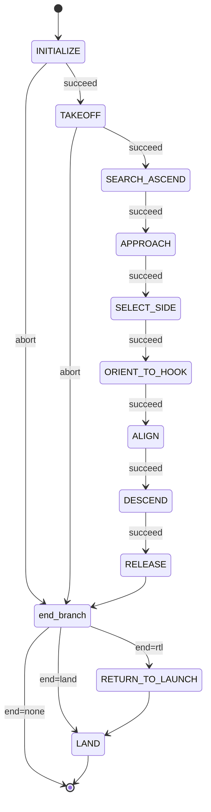

# Hook — SAE Eletroquad 2026 Mission 2

ROS 2 package for the "Hang the Right Wire" mission. The drone takes off from
the arena center, finds the orange sphere mounted on one of two ropes, parks
at a fixed real-world distance from the sphere, picks which side of the rope
to fly along, aligns perpendicular to it, descends on LIDAR, releases the hook
with a servo, and lands.

Built on [Nectar SDK](https://github.com/Black-Bee-Drones/nectar-sdk) (drone +
vision + AI) and [Yasmin](https://github.com/uleroboticsgroup/yasmin) state
machines.

## Hardware

- Drone: custom quadrotor running ArduPilot (GPS pose).
- Camera: Arducam IMX662 USB, 1920×1080, horizontal FOV 86° (diagonal 102°,
  vertical 47°), mounted nadir-pointing.
- Compute: Jetson Orin Nano.
- Hook: hobby servo on RC AUX 3 (`SERVO_CHANNEL = 3`). `HOLD_PWM = 1000`,
  `RELEASE_PWM = 2000`.
- Altitude: TFLuna LIDAR exposed by MAVROS as `rangefinder/rangefinder`. All
  inner-loop altitudes use `AltitudeSource.LIDAR`.

### Body-frame layout (FLU, +x forward, +y left)

Two offset pairs, each consumed by a different code path:

| Constant | Default | Meaning |
|---|---|---|
| `CAMERA_BODY_OFFSET_X_M` | `+0.05` | camera position in body frame from drone center, +x forward |
| `CAMERA_BODY_OFFSET_Y_M` | `-0.03` | camera y offset from drone center, +y left (so −0.03 = 3 cm right) |
| `CAMERA_TO_HOOK_BODY_X_M` | `0.00` | hook position relative to camera in body frame, +x forward |
| `CAMERA_TO_HOOK_BODY_Y_M` | `+0.10` | hook y offset from camera, +y left (so +0.10 = 10 cm left) |

`CAMERA_TO_HOOK_BODY_*` is what `perception.hook_image_offset()` uses to
project the hook into the image. Every controller parks the **hook** (not the
camera nadir) over the rope. `CAMERA_BODY_OFFSET_*` is informational for now.

The Gazebo SDF
([`simulation/worlds/sae_hook_arena.sdf`](simulation/worlds/sae_hook_arena.sdf))
mirrors this layout: down-camera at `relative_to base_link` `(+0.05, −0.03,
−0.04)`, lidar at `(−0.05, 0, −0.05)`, and a non-functional `hook_visual`
cylinder at `(+0.05, +0.07, −0.05)` so the saved JPGs show the hook position.

## Frames and conventions

- Body frame: FLU (`+x` forward, `+y` left, `+z` up).
- Down camera image: `+x` right, `+y` down. The mapping used everywhere is

  ```
  image -y  ->  body +x   (forward)
  image +x  ->  body -y   (right)
  ```

- Mission control loops are velocity-based in `MoveReference.BODY`. There is
  no GPS / position-mode flight inside the inner loops.
- The sphere and the rope are at world height `SPHERE_HEIGHT_M = 1.7 m`.
  Pixel-per-meter is computed at the *target depth* `(altitude − target_height)`,
  not at altitude alone — see `px_per_meter()` in
  [hook/core/perception.py](hook/core/perception.py).
- All position controllers feed errors in **meters** (`err_px / ppm`), not
  pixels. PID gains are `m/s per m`. This keeps response invariant across the
  altitude range each state spans.

## Strategy (one paragraph)

A single YOLO-seg model (classes `sphere`, `rose`) runs at 960 px on every
loop tick. Each visible piece of rope is its own `rose` instance, which is
what makes side selection possible. We segment, filter per class
(`sphere ≥ 0.70`, `rose ≥ 0.40`, IoU 0.6), then run state-specific control:
ascend until the sphere is debounced; capture an approach bearing once and
fly to a radial setpoint that is `APPROACH_TARGET_DISTANCE_M` real-world
meters short of the sphere (yaw-invariant); descend keeping that line; pick
the longer rope segment as the side and predict the anchor sign from it (no
open-loop body shift); pre-rotate 180° (sphere-anchored, vision-only) iff
the chosen rope is behind the drone in body frame so ALIGN never has to
back over the rope; align to a stand-off pose where the rope is held
`ALIGN_STANDOFF_M` in front of the hook; descend on LIDAR with a hard
altitude floor at `RELEASE_ALTITUDE` while the standoff ramps to 0 and the
sphere anchor is dropped once it leaves the FOV; servo the hook; RTL + land.

## State machine

`mangalarga.py::build_sm` constructs the SM from the `STAGES` registry in
[hook/states/__init__.py](hook/states/__init__.py). With `--stages` the
pipeline is truncated to a contiguous prefix; the end-branch is configured by
`--end {rtl|land|none}`. ABORT and SUCCEED both flow into the end-branch.



| State            | Stage name      | File                                                                  | What it does |
|------------------|-----------------|-----------------------------------------------------------------------|--------------|
| INITIALIZE       | (prefix)        | [hook/core/states.py](hook/core/states.py)                            | Build `MavrosDrone` (SITL or GPS), open camera (`/down_camera/compressed` in sim, OpenCV otherwise), load segmentor, build per-class confidence filter. |
| TAKEOFF          | (prefix)        | [hook/core/states.py](hook/core/states.py)                            | Arm + take off to `INITIAL_TAKEOFF_ALTITUDE`. |
| SEARCH_ASCEND    | `search_ascend` | [hook/states/search_and_ascend.py](hook/states/search_and_ascend.py)  | Hover, run segmentor; ascend at `ASCEND_VELOCITY` (capped at `MAX_ASCEND_ALTITUDE`) until `ASCENT_STOP_CONFIRMATIONS` consecutive sphere detections. |
| APPROACH         | `approach`      | [hook/states/approach_sphere.py](hook/states/approach_sphere.py)      | Step 1 (lateral): capture bearing unit `(ux0, uy0)` over `APPROACH_INIT_BEARING_FRAMES` detections; two metric PIDs drive the sphere onto a radial setpoint at `APPROACH_TARGET_DISTANCE_M`. Step 2 (descent): same PIDs while descending at `APPROACH_DESCEND_VELOCITY` until `LIDAR ≤ WORK_ALTITUDE`. Stores `approach_bearing_unit` and `approach_image_offset`. |
| SELECT_SIDE      | `select_side`   | [hook/states/select_hose_side.py](hook/states/select_hose_side.py)    | Decision-only (no movement). Sample `SIDE_SAMPLE_FRAMES` frames; lock rope long-axis from the most-confident `rose`; bucket each `rose` instance by sign of its centroid projection onto that axis from the sphere; pick side with greater accumulated long-axis length. Tie (`ratio < SIDE_LENGTH_RATIO`) → fallback to side anti-aligned with `approach_image_offset`. Stores `hose_side_image_unit` and `anchor_sign` (predicted from sign of `side_unit.x`). |
| ORIENT_TO_HOOK   | `orient_to_hook`| [hook/states/orient_to_hook.py](hook/states/orient_to_hook.py)        | Sample-and-decide (`ORIENT_BEHIND_SAMPLE_FRAMES` frames): chosen-rope mask body-x = `-(hose_cy − IMAGE_CENTER_Y) / ppm`. SUCCEED immediately if median ≥ `−ORIENT_BEHIND_THRESHOLD_M` (rope already in front). Otherwise spin 180° using the sphere image-frame polar angle around image center: `theta_target = wrap_pi(theta_0 + π − ε)` (ε-bias gives deterministic CCW direction); single SDK PID on `wrap_pi(theta_current − theta_target)` outputs `vyaw` clipped to `±ORIENT_MAX_YAW_VELOCITY`. Converged after `ORIENT_CONFIRMATIONS` consecutive frames with `\|err\| < ORIENT_ANGLE_TOLERANCE_RAD`. On success negates `hose_side_image_unit` and `anchor_sign` on the blackboard so ALIGN/DESCEND see the post-flip body frame transparently. Sphere-loss tolerant (holds last `vyaw` for up to `ORIENT_MAX_LOST_FRAMES` frames). |
| ALIGN            | `align`         | [hook/states/align_to_hose.py](hook/states/align_to_hose.py)          | Three SDK PIDs on metric errors: `vyaw` on hose long-axis angle (target 0° = horizontal); `vy` on sphere image-x with anchor offset (`SPHERE_ANCHOR_DISTANCE_M`); `vx` on hose image-y with target row offset by `ALIGN_STANDOFF_M` so the rope sits ahead of the hook. Yaw-first sub-phase: while `\|angle\| > ALIGN_YAW_FIRST_TOLERANCE_DEG` only `vyaw` runs (`vx = vy = 0`). Converged when all three errors stay below their tolerances for `HOSE_ALIGN_CONFIRMATIONS` frames. |
| DESCEND          | `descend`       | [hook/states/descend.py](hook/states/descend.py)                      | Same three PIDs as ALIGN. Standoff linearly ramps from `ALIGN_STANDOFF_M` → 0 over `DESCEND_STANDOFF_RAMP_TICKS` ticks so the rope target slides under the hook smoothly. Sphere anchor disabled (`vy = 0`) once `target_sphere_cx` leaves the FOV margin (`DESCEND_SPHERE_TARGET_MARGIN_PX`); fallback hose pick uses the most-confident `rose` if the sphere is gone. Vertical command is altitude-proportional: `vz = -clip(DESCEND_VZ_KP·(alt − RELEASE_ALTITUDE), VZ_MIN, VZ_MAX)` with hard zero at and below the floor — lateral and yaw keep running. SUCCEED when `LIDAR ≤ RELEASE_ALTITUDE` AND lateral/angle errors under tolerance for `DESCEND_RELEASE_CONFIRMATIONS` frames. Aborts only on hose-loss. |
| RELEASE          | `release`       | [hook/states/release_hook.py](hook/states/release_hook.py)            | Stop motion, drive `SERVO_CHANNEL` from `HOLD_PWM` to `RELEASE_PWM`. |
| RETURN_TO_LAUNCH | (suffix)        | [hook/core/states.py](hook/core/states.py)                            | `drone.rtl(altitude=RTL_ALTITUDE, method=NAVIGATE, land=False)`. |
| LAND             | (suffix)        | [hook/core/states.py](hook/core/states.py)                            | `drone.land()` then close camera. |

## APPROACH — radial setpoint, metric PIDs, safety

- **Radial setpoint.** On the first `APPROACH_INIT_BEARING_FRAMES` good
  detections the median `(ux0, uy0)` is computed from sphere offsets to image
  center and frozen. Each tick the setpoint is

  ```
  target_px = APPROACH_TARGET_DISTANCE_M * px_per_meter(alt, SPHERE_HEIGHT_M)
  setpoint  = image_center + (ux0, uy0) * target_px + hook_image_offset(alt)
  ```

  This puts the **hook** on the world line *takeoff → sphere*, exactly
  `APPROACH_TARGET_DISTANCE_M` short of the sphere, regardless of yaw. See
  [`approach_setpoint`](hook/core/perception.py).

- **Metric PIDs.** Two SDK `PIDController`s (`pid_x`, `pid_y`) feed on
  `err_px / ppm` so the response to a real-world error is the same at any
  altitude. Gain `APPROACH_KP_M = 0.80 m/s per m`. Output deadband =
  `PID_MIN_OUTPUT_VELOCITY_XY` (suppresses sub-noise commands). Output clamp
  `±APPROACH_MAX_VELOCITY_XY`. An error deadband (`err_m < APPROACH_TOL_M`)
  zeros the command and resets both PIDs.

- **Bearing-skip threshold.** If the very first detection is closer than
  `APPROACH_MIN_INIT_DIST_M` (real meters), the bearing is set to `(0, 0)`
  and the descent goes straight down.

- **Safety (`_enforce_safety`).** If the live sphere distance from the camera
  nadir is below `APPROACH_MIN_SAFE_DISTANCE_M`, the toward-sphere component
  of `(vx, vy)` is stripped; perpendicular and away motion is preserved.

- **Step-2 altitude floor.** The main path exits via SUCCEED the moment
  `altitude ≤ WORK_ALTITUDE`. The no-pose blind-descent fallback also
  respects that floor (`vz = 0` below it).

- **Saved overlay** (per frame, `~/sae2026/<ts>/approach_sphere/`):
  segmentation masks (custom palette + polygon outline + label chip), cyan
  `+` at image center, red dot at sphere centroid, magenta line cyan→sphere
  with live distance (m + px), yellow circle of radius `APPROACH_TOL_M·ppm`
  at the drone target, green error arrow, top-left HUD with `alt`, `D`,
  `ppm`, error in m and px, and live `vx vy vz`.

## ORIENT_TO_HOOK — break the 180° symmetry

ALIGN's three controllers are **180°-symmetric** about the chosen rope axis:
rope angle = 0 (horizontal in image), `hose_cy = IMAGE_CENTER_Y − ALIGN_STANDOFF_M·ppm`
(rope `ALIGN_STANDOFF_M` in front), and `sphere_cx = IMAGE_CENTER_X +
anchor_sign·SPHERE_ANCHOR_DISTANCE_M·ppm` are all satisfied at *both* yaws —
rope-in-front and rope-behind. When SELECT_SIDE leaves the drone facing the
"wrong" 180° fixed point (chosen rope in image lower half, body x < 0), the
center PID would drag the drone backward 1+ m **across** the rope to settle
on the standoff target. This state pre-empts that with a yaw flip.

- **Trigger.** Median over `ORIENT_BEHIND_SAMPLE_FRAMES` good frames of the
  chosen rope (`pick_hose_by_dir(sphere, hoses, side_unit)`):

  ```
  rope_body_x = -(hose_cy - IMAGE_CENTER_Y) / px_per_meter(altitude, SPHERE_HEIGHT_M)
  ```

  Triggers the spin iff `rope_body_x < -ORIENT_BEHIND_THRESHOLD_M`
  (default −0.10 m). Otherwise SUCCEED immediately — the working
  `drone_yaw_deg=0` / `drone_yaw_deg=45` cases never enter the spin branch.

- **Closed-loop reference.** The sphere is uniquely identified
  (highest-confidence `sphere` instance), so its image-frame polar angle
  around image center is the only signal that survives an arbitrary yaw
  rotation without identity ambiguity:

  ```
  theta_0      = atan2(sy - IMAGE_CENTER_Y, sx - IMAGE_CENTER_X)
  theta_target = wrap_pi(theta_0 + pi - 1e-3)   # eps-bias for deterministic CCW
  err_rad      = wrap_pi(theta_current - theta_target)
  vyaw         = pid_yaw.update(err_rad)        # PID setpoint=0 -> output ≈ -kp·err
  ```

  At entry `err_rad ≈ -π+ε`, so `vyaw ≈ +ORIENT_MAX_YAW_VELOCITY` (positive
  = CCW in FLU body). The 180°-flipped sphere image position is `(2·cx-sx,
  2·cy-sy)`; its polar angle is exactly `theta_0 + π`, so the loop converges
  to `err_rad → 0` after one body 180° yaw.

- **Sphere-loss robustness.** If `best_sphere` returns None for one tick,
  the last commanded `vyaw` is held (open-loop continuation: angular
  momentum is consistent across one missed frame). Aborts only after
  `ORIENT_MAX_LOST_FRAMES` consecutive misses or `ORIENT_TIMEOUT` seconds.
  Hose tracking is *not* required during the spin.

- **Commit.** On convergence
  (`|err_rad| < ORIENT_ANGLE_TOLERANCE_RAD` for `ORIENT_CONFIRMATIONS`
  frames), atomically:

  ```python
  blackboard["hose_side_image_unit"] = (-side_unit[0], -side_unit[1])
  blackboard["anchor_sign"]          = -anchor_sign
  ```

  After a body 180° yaw the same physical rope appears extending in
  `(-side_unit[0], -side_unit[1])` from the sphere, and the sphere appears
  on the opposite image side, so both signs flip together.
  `anchor_sign_for_side(new_side_unit)` returns the negated value, keeping
  the algebraic invariant intact for ALIGN and DESCEND, which read both
  values without modification.

- **Saved overlay** (per frame, `~/sae2026/<ts>/orient_to_hook/`): cyan `+`
  at image center, red dot at live sphere, dashed yellow ray to the desired
  sphere polar angle (`theta_target`), magenta ray to the live polar angle
  (`theta_current`), yellow chosen-rope axis when available, HUD with
  `phase` (`sample`/`spin`), `rope body_x`, `theta_curr`, `theta_tgt`,
  `err_deg`, and commanded `vyaw`.

## ALIGN / DESCEND — sphere-anchored stand-off

ALIGN converges to a stand-off pose: the rope is held `ALIGN_STANDOFF_M` in
front of the hook (image upper half), the sphere anchored at
`SPHERE_ANCHOR_DISTANCE_M` from the hook along the chosen rope direction
(image x offset = `anchor_sign · D`), and the drone yaw perpendicular to the
rope (rope angle ~0°). DESCEND keeps the same three controllers and slides
the standoff to 0 over `DESCEND_STANDOFF_RAMP_TICKS` ticks while descending.

Wiring (image-to-body: `image -y → body +x`, `image +x → body -y`):

```
vx   ← pid_center.update((hose_cy - target_hose_cy) / ppm)
vy   ← pid_anchor.update((sphere_cx - target_sphere_cx) / ppm)
vyaw ← pid_yaw.update(angle_deg)
```

`anchor_sign` is **predicted** from `sign(side_unit.x)` after SELECT_SIDE
chooses the closest perpendicular yaw (smaller of the two valid 90° rotations
to keep the side direction's x-sign). No open-loop shift, no post-shift
measurement; the sign is stored on the blackboard and reused by both states.

The yaw-first sub-phase prevents `vx` and `vy` from acting on `hose_cy` /
`sphere_cx` until the rope is close to horizontal in the image, since those
signals are geometrically meaningless until then.

In DESCEND the sphere anchor is disabled once its target image-x falls
outside `[DESCEND_SPHERE_TARGET_MARGIN_PX, IMAGE_WIDTH − margin]`. Below
that altitude the drone has already aligned within the anchor tolerance;
`vy = 0` and the FCU position-hold absorbs any micro-drift while the descent
finishes on hose-only references. If the sphere is lost (so
`pick_hose_by_dir` returns `None`) the chosen hose falls back to the
most-confident `rose` instance — at low altitude the other rope is well
outside the camera frustum so the remaining detection is necessarily the
chosen one.

Vertical command in DESCEND is proportional to altitude above the floor:

```
vz = -clip(DESCEND_VZ_KP * (altitude - RELEASE_ALTITUDE),
           DESCEND_VZ_MIN, DESCEND_VZ_MAX)        if altitude > RELEASE_ALTITUDE
vz = 0                                            otherwise
```

The hard floor is enforced even in the no-pose fallback. SUCCEED requires
`altitude ≤ RELEASE_ALTITUDE` AND `centered AND angle_ok` for
`DESCEND_RELEASE_CONFIRMATIONS` frames; the anchor gate is True whenever the
sphere can't anchor, so DESCEND can finish without it. Only hose-loss
(more than `DESCEND_MAX_LOST_FRAMES`) aborts.

## Visualization

Every saved frame uses the shared composite drawers in
[hook/core/overlay.py](hook/core/overlay.py):

- `annotate_seg(frame, result)` — high-contrast palette (cyan / magenta /
  lime / yellow), mask fill at low opacity, polygon outline, label chip with
  black text. Replaces the SDK's default `draw_segmentations` whose default
  palette blends with the rope's red.
- Per-state composite drawers (`draw_search_ascend`, `draw_select_side`,
  `draw_align`, `draw_descend`) add controller geometry: image center (cyan
  `+`), hook image projection (magenta `+`), detected hose axis (yellow
  line), target hose row (green dashed line + tolerance band), target sphere
  position (yellow ring + tilted cross, drawn red when out of FOV margin),
  detected sphere centroid (red dot), error arrows, and a left HUD (state
  + alt + ppm, errors in m and px, commanded velocities) plus a right HUD
  (state-specific extras: `anchor_sign`, `standoff_m`, tolerances, release
  altitude bar in DESCEND).
- APPROACH keeps its own bespoke radial-bearing overlay; the segmentation
  layer is the same `annotate_seg`.

Frames are saved every tick (no skipping) under
`DETECTION_SAVE_PATH/<ts>/<state>/`.

## Mission entry point

`ros2 run hook mangalarga` parses an argparse CLI on `sys.argv` (after
`rclpy.utilities.remove_ros_args`):

```
--stages all | <name> | <n1>,<n2>,...   # contiguous prefix of STAGES (default all)
--end rtl | land | none                  # what runs after the last stage (default rtl)
--list                                   # print stage names in order and exit
```

Stage names (in mission order): `search_ascend`, `approach`, `select_side`,
`orient_to_hook`, `align`, `descend`, `release`. A multi-name `--stages`
value must equal the first N of that list (no skipping; controllers depend
on blackboard keys set by the previous stage).

End-branch:

- `rtl` (default): `RETURN_TO_LAUNCH → LAND`.
- `land`: `LAND` immediately.
- `none`: SM terminates; the drone is left in whatever state the last stage
  finished in. Useful to inspect convergence in sim.

ABORT from any stage routes to the same end-branch. Failures from
`INITIALIZE` and `TAKEOFF` also route there; `RTL`/`LAND` no-op safely if
the drone wasn't created.

## Simulation

Gazebo Harmonic + ArduCopter SITL. The launch file
[launch/sae_hook.launch.py](launch/sae_hook.launch.py) reads the canonical
SDF [simulation/worlds/sae_hook_arena.sdf](simulation/worlds/sae_hook_arena.sdf),
rewrites the iris and sphere `<pose>` tags, writes the result to
`/tmp/sae_hook_arena_*.sdf`, and forwards that path to nectar's
`sitl_gazebo.launch.py`. It also runs an `image_transport republish` node
converting `/down_camera` (raw) → `/down_camera/compressed`.

```bash
# Terminal 1: ArduCopter SITL pointed at Gazebo
make sim-start-gazebo

# Terminal 2: Gazebo + MAVROS + camera republish
ros2 launch hook sae_hook.launch.py

# Terminal 3: mission (sim mode)
HOOK_SIM=1 ros2 run hook mangalarga
```

`HOOK_SIM=1` switches `IMAGE_SOURCE` to `/down_camera/compressed` (subscribed
with `compressed=True`) and the drone config to `SITL_GAZEBO_CONFIG`.

### Launch args

| Arg | Default | Meaning |
|---|---|---|
| `drone_x`, `drone_y` | `0.0`, `0.0` | iris XY at spawn (m). |
| `drone_yaw_deg` | `0.0` | iris yaw at spawn (deg, positive = CCW). |
| `sphere_x`, `sphere_y` | `2.0`, `1.25` | sphere XY (m). Z fixed at `SPHERE_Z = 1.7 m`. |
| `fcu_url` | `tcp://127.0.0.1:5760` | MAVLink URL forwarded to `sitl_gazebo.launch.py`. |

Examples:

```bash
ros2 launch hook sae_hook.launch.py drone_yaw_deg:=45 sphere_x:=-2.5
ros2 launch hook sae_hook.launch.py drone_yaw_deg:=180 sphere_x:=3.5 sphere_y:=1.25
```

### Recipes

```bash
# Stage 1 only, drone facing 90°, sphere at -3 m on hose A
ros2 launch hook sae_hook.launch.py drone_yaw_deg:=90 sphere_x:=-3.0
HOOK_SIM=1 ros2 run hook mangalarga --stages search_ascend --end land

# Stages 1-5, hover at end (no auto RTL/LAND) for inspection
ros2 launch hook sae_hook.launch.py drone_yaw_deg:=180 sphere_x:=2.5
HOOK_SIM=1 ros2 run hook mangalarga --stages search_ascend,approach,select_side,orient_to_hook,align --end none
```

## Package structure

```
hook/
  hook/
    mangalarga.py             # entry point: argparse + build_sm + run
    core/
      constants.py            # all tunable parameters
      perception.py           # run_seg, best_sphere, hose_segments, hose_pose,
                              # px_per_meter, hook_image_offset, approach_setpoint,
                              # alignment_targets, anchor_sign_for_side, pick_hose_by_dir
      overlay.py              # annotate_seg + per-state composite drawers
      states.py               # Initialize, Takeoff, ReturnToLaunch, Land
    states/
      __init__.py             # STAGES registry (mission order)
      search_and_ascend.py
      approach_sphere.py
      select_hose_side.py
      orient_to_hook.py
      align_to_hose.py
      descend.py
      release_hook.py
  launch/
    sae_hook.launch.py        # Gazebo + MAVROS, drone/sphere pose CLI args
  simulation/worlds/
    sae_hook_arena.sdf        # canonical world (rewritten at launch)
  share/models/               # *.pt model weights (committed)
  package.xml
  setup.py
```

`DETECTION_SAVE_PATH` (`~/sae2026/<ts>/<state>/`) collects per-frame
annotated JPEGs when `SAVE_DETECTIONS = True`. The directory is outside the
repo.

## Parameters (current defaults)

All in [hook/core/constants.py](hook/core/constants.py).

### Altitude
| Name | Value | Used in |
|---|---|---|
| `INITIAL_TAKEOFF_ALTITUDE` | 4.0 m | TAKEOFF |
| `MAX_ASCEND_ALTITUDE` | 6.8 m | SEARCH_ASCEND cap |
| `WORK_ALTITUDE` | 3.0 m | end of APPROACH descent |
| `RELEASE_ALTITUDE` | 2.0 m | hard floor in DESCEND |
| `RTL_ALTITUDE` | 2.7 m | RTL |

### Camera + body layout
| Name | Value |
|---|---|
| `IMAGE_WIDTH × IMAGE_HEIGHT` | 1920 × 1080 |
| `HORIZONTAL_FOV_DEG` / `VERTICAL_FOV_DEG` | 86.0 / 47.0 |
| `CAMERA_BODY_OFFSET_X_M` / `_Y_M` | +0.05 / −0.03 |
| `CAMERA_TO_HOOK_BODY_X_M` / `_Y_M` | 0.00 / +0.10 |
| `SPHERE_HEIGHT_M` | 1.7 |
| `PPM_REF` (derived) | `IMAGE_WIDTH / (2·(WORK_ALTITUDE − SPHERE_HEIGHT_M)·tan(HFOV/2))` |

### Segmentation
| Name | Value |
|---|---|
| `SEG_MODEL_PATH` | `share/models/sae-2026-hang-all-yolo26n-seg-v2-960.pt` |
| `SEG_IMGSZ` / `SEG_IOU` | 960 / 0.6 |
| `SPHERE_CONF` / `HOSE_CONF` | 0.70 / 0.40 |
| `SEG_PREDICT_CONF` | `min(SPHERE_CONF, HOSE_CONF)` (passed to `predict`; per-class filter refines) |

### Shared PID deadbands
| Name | Value | Notes |
|---|---|---|
| `PID_MIN_OUTPUT_VELOCITY_XY` | 0.06 m/s | `output_deadband` on every xy PID |
| `PID_MIN_OUTPUT_VYAW` | 0.01 rad/s | `output_deadband` on every yaw PID |

### SEARCH_ASCEND
| Name | Value |
|---|---|
| `ASCEND_VELOCITY` | 0.3 m/s |
| `ASCENT_STOP_CONFIRMATIONS` | 20 |
| `ASCENT_TIMEOUT` | 60.0 s |

### APPROACH
| Name | Value |
|---|---|
| `APPROACH_TARGET_DISTANCE_M` | 0.72 m |
| `APPROACH_MIN_SAFE_DISTANCE_M` | 0.50 m |
| `APPROACH_KP_M` | 0.80 m/s per m |
| `APPROACH_TOL_M` | 0.10 m |
| `APPROACH_CONFIRMATIONS` | 8 |
| `APPROACH_MAX_VELOCITY_XY` | 0.28 m/s |
| `APPROACH_INIT_BEARING_FRAMES` | 3 |
| `APPROACH_MIN_INIT_DIST_M` | 0.12 m |
| `APPROACH_DESCEND_VELOCITY` | 0.20 m/s |
| `APPROACH_TIMEOUT` | 90 s |
| `APPROACH_MAX_LOST_FRAMES` | 50 |

### SELECT_SIDE
| Name | Value |
|---|---|
| `SIDE_SAMPLE_FRAMES` | 20 |
| `SIDE_LENGTH_RATIO` | 1.4 |
| `SIDE_TIMEOUT` | 30.0 s |

### ORIENT_TO_HOOK
| Name | Value |
|---|---|
| `ORIENT_BEHIND_THRESHOLD_M` | 0.10 m |
| `ORIENT_BEHIND_SAMPLE_FRAMES` | 8 |
| `ORIENT_YAW_KP` | 0.6 rad/s per rad |
| `ORIENT_MAX_YAW_VELOCITY` | 0.5 rad/s |
| `ORIENT_ANGLE_TOLERANCE_RAD` | `math.radians(10.0)` |
| `ORIENT_CONFIRMATIONS` | 4 |
| `ORIENT_TIMEOUT` | 25.0 s |
| `ORIENT_MAX_LOST_FRAMES` | 60 |

### ALIGN
| Name | Value |
|---|---|
| `HOSE_MIN_CONTOUR_AREA` | 200 px² |
| `HOSE_ANGLE_TOLERANCE_DEG` / `HOSE_ANGLE_KP` / `HOSE_ANGLE_MAX_VELOCITY` | 5.0° / 0.0098 rad/s/° / 0.28 rad/s |
| `HOSE_CENTER_TOLERANCE_M` / `HOSE_CENTER_KP` / `HOSE_CENTER_MAX_VELOCITY` | 0.050 m / 0.80 m/s/m / 0.25 m/s |
| `SPHERE_ANCHOR_DISTANCE_M` / `SPHERE_ANCHOR_TOLERANCE_M` / `SPHERE_ANCHOR_KP` | 0.5 m / 0.055 m / 0.66 m/s/m |
| `ALIGN_STANDOFF_M` | 0.30 m |
| `ALIGN_YAW_FIRST_TOLERANCE_DEG` | 18.0° |
| `HOSE_ALIGN_CONFIRMATIONS` | 8 |
| `HOSE_ALIGN_TIMEOUT` | 100 s |
| `HOSE_ALIGN_MAX_LOST_FRAMES` | 60 |

### DESCEND
| Name | Value |
|---|---|
| `DESCEND_VZ_KP` / `DESCEND_VZ_MIN` / `DESCEND_VZ_MAX` | 0.20 / 0.05 / 0.20 m/s |
| `DESCEND_CENTER_KP` / `DESCEND_ANGLE_KP` / `DESCEND_ANCHOR_KP` | 0.65 m/s/m / 0.0088 rad/s/° / 0.60 m/s/m |
| `DESCEND_MAX_VELOCITY_XY` / `DESCEND_MAX_YAW_VELOCITY` | 0.22 m/s / 0.30 rad/s |
| `DESCEND_CENTER_TOLERANCE_M` / `DESCEND_ANGLE_TOLERANCE_DEG` / `DESCEND_ANCHOR_TOLERANCE_M` | 0.07 m / 5.0° / 0.068 m |
| `DESCEND_STANDOFF_RAMP_TICKS` | 30 |
| `DESCEND_SPHERE_TARGET_MARGIN_PX` | 100 |
| `DESCEND_RELEASE_CONFIRMATIONS` | 5 |
| `DESCEND_TIMEOUT` | 120 s |
| `DESCEND_MAX_LOST_FRAMES` | 60 (counts ONLY hose losses) |

### Servo
| Name | Value |
|---|---|
| `SERVO_CHANNEL` / `HOLD_PWM` / `RELEASE_PWM` | 3 / 1000 / 2000 |

### Saving / sim
| Name | Value |
|---|---|
| `SAVE_DETECTIONS` | True |
| `DETECTION_SAVE_PATH` | `~/sae2026` |
| `SIM_MODE` | `os.environ.get("HOOK_SIM", "0") == "1"` |
| `SIM_IMAGE_SOURCE` | `/down_camera/compressed` |
| `SIM_IMAGE_COMPRESSED` | True |

### Tuning notes

| Symptom | Knob |
|---|---|
| Drone parks too close to sphere | raise `APPROACH_TARGET_DISTANCE_M` and/or `APPROACH_MIN_SAFE_DISTANCE_M`. |
| APPROACH oscillates around the band | raise `APPROACH_TOL_M`; check `PID_MIN_OUTPUT_VELOCITY_XY` covers MAVROS noise. |
| APPROACH slow at long range | raise `APPROACH_KP_M` and/or `APPROACH_MAX_VELOCITY_XY`. |
| ALIGN never exits yaw-first | lower `ALIGN_YAW_FIRST_TOLERANCE_DEG` (more time in yaw-only) or raise it (switch to full sooner). |
| ALIGN/DESCEND drift around the rope | raise `HOSE_CENTER_TOLERANCE_M` / `SPHERE_ANCHOR_TOLERANCE_M`; tune their `*_KP`. |
| ORIENT_TO_HOOK fires when not needed (rope barely behind) | raise `ORIENT_BEHIND_THRESHOLD_M` (more behind required to trigger). |
| ORIENT_TO_HOOK should fire but skips | lower `ORIENT_BEHIND_THRESHOLD_M` or check that `pick_hose_by_dir` consistently picks the chosen rope (sphere_conf, hose_conf). |
| ORIENT_TO_HOOK overshoots / oscillates near target | lower `ORIENT_YAW_KP` or `ORIENT_MAX_YAW_VELOCITY`; raise `ORIENT_ANGLE_TOLERANCE_RAD` if jitter near target prevents exit. |
| ORIENT_TO_HOOK aborts on sphere loss | raise `ORIENT_MAX_LOST_FRAMES`; verify segmentor sphere recall under motion blur during fast yaw. |
| DESCEND crosses the rope at the start | raise `DESCEND_STANDOFF_RAMP_TICKS` (slower ramp) or lower `DESCEND_CENTER_KP`. |
| DESCEND too fast near release | lower `DESCEND_VZ_MIN` or `DESCEND_VZ_MAX`. |
| Mission gives up too early during dropouts | raise `APPROACH_MAX_LOST_FRAMES` / `HOSE_ALIGN_MAX_LOST_FRAMES` / `DESCEND_MAX_LOST_FRAMES`. |

## Models

`share/models/sae-2026-hang-all-yolo26n-seg-v2-960.pt` — combined YOLO11n-seg
trained on classes `sphere` and `rose`. Best thresholds: `sphere=0.70`,
`rose=0.40`, `iou=0.6`, `imgsz=960`. Model card:
[blackbeedrones/sae-2026-hang-all-yolo26n-seg-v2-960](https://huggingface.co/blackbeedrones/sae-2026-hang-all-yolo26n-seg-v2-960/blob/main/SUMMARY.md).

The path is resolved at runtime via
`get_package_share_directory("hook") / "models" / ...`. The weights file is
committed to git (see `.gitignore` at the SAE-2026 repo root).

## Build / install

```bash
cd ~/ros2_ws
colcon build --packages-select hook
source install/setup.bash
```

Console scripts (`setup.py` `entry_points`):

| Command | Function |
|---|---|
| `ros2 run hook mangalarga` | `hook.mangalarga:main` |

## Dependencies

Declared in [package.xml](package.xml):

- `rclpy`
- `nectar`, `nectar_interfaces` — drone (MAVROS), vision, AI.
- `yasmin`, `yasmin_ros`, `yasmin_viewer` — state machine.
- ROS 2 (tested on Humble). Ultralytics + supervision are pulled in by
  Nectar for the segmentor.

## References

- [SAE Eletroquad 2026 rules](../Regulamento_EletroQuad_2026_portugues.pdf)
- [Nectar SDK README](https://github.com/Black-Bee-Drones/nectar-sdk/blob/main/README.md)
