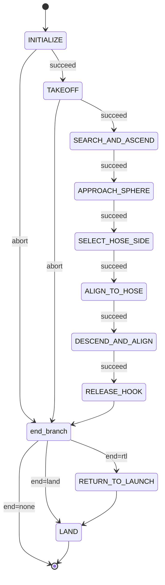

# Hook - SAE Eletroquad 2026 Mission 2

ROS 2 package for the "Hang the Right Wire" mission. The drone takes off from the center of a 7m-diameter arena, identifies which of two ropes carries the orange sphere, flies to that rope, hangs a hook via servo, and returns to land.

Built with [Nectar SDK](https://github.com/Black-Bee-Drones/nectar-sdk) and [Yasmin](https://github.com/uleroboticsgroup/yasmin) state machines.

## Hardware

- **Drone**: Custom quadrotor with ArduPilot (GPS-based pose)
- **Camera**: Arducam 2MP IMX662 Ultra Low Light USB (102deg diagonal, 1920x1080)
- **Compute**: Jetson Orin Nano
- **Hook mechanism**: Servo motor (AUX 3)
- **Altitude**: TFLuna LIDAR via MAVROS rangefinder (primary altitude source in working states)

## Strategy

Single combined instance-segmentation model with two classes (`sphere`, `rose`/hose) at imgsz=960. The model segments **each visible hose section** as its own `rose` instance, which is what enables the side-selection logic.

The mission stays velocity-based in the body frame; no GPS / position-mode flight inside the inner loops. Altitude inside the working states is read from the TFLuna LIDAR (`AltitudeSource.LIDAR`).

Flow:

1. **Search-and-ascend**: takeoff to a low altitude, then ascend while running the model. Stop when the sphere is detected with a debounced confirmation count, capped at 6.5 m.
2. **Approach the sphere**: drive the sphere to a fixed *physical* distance (~35 cm) from the camera footprint center using a dynamic pixel target derived from LIDAR altitude and the camera's horizontal FOV. Intentionally off-center to keep LIDAR readings on the ground, not on the sphere or the hose.
3. **Descend to working altitude** while keeping the same lateral offset.
4. **Select hose side**: at the working altitude both `rose` segments are usually visible. Pick the longer one (median minAreaRect long side over a few frames). If the two sides have similar lengths, fall back to the heuristic *"go opposite to where the approach pulled us"* (closer to the arena center).
5. **Shift along the chosen hose** (~0.3 m) so that segment dominates the image and the sphere is anchored on one side.
6. **Align to hose with sphere anchor**: dual-anchor PID. Yaw → hose angle perpendicular; body-y → hose center_x; body-x → sphere image-y to sit at a fixed along-hose distance from the sphere (`SPHERE_ANCHOR_DISTANCE_M`). Anchoring the drone relative to the sphere makes the release pose repeatable regardless of starting orientation.
7. **Descend on LIDAR** while holding the same dual-anchor alignment until `RELEASE_ALTITUDE`.
8. **Release** the hook (servo) and **RTL → land**.

## State Machine

The state machine is built dynamically by `mangalarga.py::build_sm` from the
ordered `STAGES` registry in `hook/states/__init__.py`. The full pipeline:



Any stage's ABORT goes to the same end branch as success. With `--stages`
the pipeline is truncated to a contiguous prefix of the registry.

### States

| State | File | Description |
|-------|------|-------------|
| INITIALIZE | `core/states.py` | Create drone (DroneFactory/MAVROS), camera, load combined segmentation model |
| TAKEOFF | `core/states.py` | Arm, set home, take off to `INITIAL_TAKEOFF_ALTITUDE` (4.5 m) |
| SEARCH_AND_ASCEND | `states/search_and_ascend.py` | Ascend at `ASCEND_VELOCITY` until sphere is debounced (cap 6.5 m) |
| APPROACH_SPHERE | `states/approach_sphere.py` | Drive sphere to ~35 cm horizontal offset (dynamic pixel target from LIDAR + FOV); descend to `WORK_ALTITUDE` |
| SELECT_HOSE_SIDE | `states/select_hose_side.py` | Pick the longer `rose` instance (vision; fallback to approach-direction heuristic); shift body-frame along that side |
| ALIGN_TO_HOSE | `states/align_to_hose.py` | Dual-anchor PID: hose angle → 0, hose center_x → image center, sphere image-y → fixed along-hose offset |
| DESCEND_AND_ALIGN | `states/descend.py` | Same dual-anchor PID with `vz < 0`, descending on LIDAR until `RELEASE_ALTITUDE` |
| RELEASE_HOOK | `states/release_hook.py` | Servo actuation to release hook |
| RETURN_TO_LAUNCH | `core/states.py` | Navigate back to takeoff position |
| LAND | `core/states.py` | Land and cleanup |

## Package Structure

```
hook/
  hook/
    mangalarga.py             # Entry point + flat SM builder + CLI parsing
    core/
      constants.py            # All tunable parameters
      perception.py           # Shared seg helpers (run_seg, best_sphere, hose_segments, ...)
      states.py               # Initialize, Takeoff, ReturnToLaunch, Land
    states/
      __init__.py             # STAGES registry (name -> State class, mission order)
      search_and_ascend.py    # Ascend-while-detecting
      approach_sphere.py      # Lateral approach + descent to work altitude
      select_hose_side.py     # Pick longer hose segment, shift along it
      align_to_hose.py        # Dual-anchor alignment (hose + sphere)
      descend.py              # Descent on LIDAR with dual-anchor alignment
      release_hook.py         # Servo release
  launch/
    sae_hook.launch.py        # Gazebo + MAVROS, with drone/sphere pose args
  simulation/worlds/
    sae_hook_arena.sdf        # Canonical arena SDF (templated at launch time)
  share/models/               # Place model weights here
  package.xml
  setup.py
```

## Models

Place trained model weights in `share/models/`:

- `sae-2026-hang-all-yolo26n-seg-v2-960.pt` -- combined YOLO-seg model with classes `sphere` and `rose`. Optimal thresholds: `sphere=0.70`, `rose=0.47`, `iou=0.6`, `imgsz=960`. See [model card](https://huggingface.co/blackbeedrones/sae-2026-hang-all-yolo26n-seg-v2-960/blob/main/SUMMARY.md).

The model file is referenced via `ament_index_python.packages.get_package_share_directory("hook")`.

## Parameters

Key parameters in `hook/core/constants.py`:

| Parameter | Default | Description |
|-----------|---------|-------------|
| `INITIAL_TAKEOFF_ALTITUDE` | 4.5 m | Takeoff height before ascent search |
| `MAX_ASCEND_ALTITUDE` | 6.5 m | Cap for the ascend-while-detect phase |
| `WORK_ALTITUDE` | 3.2 m | End of approach descent |
| `RELEASE_ALTITUDE` | 2.0 m | LIDAR altitude at hook release (hose top ~1.7 m) |
| `RTL_ALTITUDE` | 5.0 m | Safe return altitude |
| `ASCEND_VELOCITY` | 0.4 m/s | Upward speed during search-and-ascend |
| `ASCENT_STOP_CONFIRMATIONS` | 20 | Consecutive sphere detections required to stop ascent |
| `APPROACH_TARGET_DISTANCE_M` | 0.35 m | Physical horizontal distance to keep from sphere |
| `SIDE_LENGTH_RATIO` | 1.4 | Min `long/short` ratio to commit to vision-based side pick |
| `HOSE_SHIFT_VELOCITY` | 0.2 m/s | Side-shift velocity along chosen hose |
| `SPHERE_ANCHOR_DISTANCE_M` | 0.6 m | Along-hose distance to keep from sphere during alignment/descent |
| `HOSE_ANGLE_TOLERANCE_DEG` | 5.0 | Convergence band for perpendicular alignment |
| `HOSE_CENTER_TOLERANCE_PX` | 40 | Convergence band for hose centering |
| `SPHERE_ANCHOR_TOLERANCE_PX` | 35 | Convergence band for sphere anchor |
| `DESCEND_VELOCITY` | 0.1 m/s | Descent rate |
| `SERVO_CHANNEL` | 3 | AUX output for hook servo |

## Usage

Build:

```bash
cd ~/ros2_ws
colcon build --packages-select hook
source install/setup.bash
```

Run the full mission (real hardware):

```bash
ros2 run hook mangalarga
```

### Stage selection

`mangalarga` runs `INITIALIZE -> TAKEOFF -> [stages] -> end-branch`. The
`--stages` flag picks a contiguous prefix of the mission stages, useful for
testing one piece at a time. `--end` controls what runs after the last
stage: `rtl` (default; RETURN_TO_LAUNCH then LAND), `land` (LAND in place),
or `none` (terminate immediately, leaves the drone in its current state).

```bash
ros2 run hook mangalarga --list                          # list stage names
ros2 run hook mangalarga --stages search_ascend          # 1st stage only, RTL+land
ros2 run hook mangalarga --stages approach               # through 2nd stage, RTL+land
ros2 run hook mangalarga --stages search_ascend,approach --end land
ros2 run hook mangalarga --end none                      # full mission, no auto end
```

Stage names (in order): `search_ascend`, `approach`, `select_side`,
`align`, `descend`, `release`.

## Simulation

Gazebo Harmonic world (`sae_hook_arena.sdf`) replicating the M2 arena: two
red hoses at 1.7 m, orange sphere, takeoff base, support posts. Down camera
matches the Arducam IMX662 FOV. Uses Nectar SDK's SITL infrastructure.

```bash
# Terminal 1: ArduPilot SITL
make sim-start-gazebo

# Terminal 2: Gazebo + MAVROS (default poses)
ros2 launch hook sae_hook.launch.py

# Terminal 3: Mission in sim mode
HOOK_SIM=1 ros2 run hook mangalarga
```

`HOOK_SIM=1` switches camera source to `/down_camera` (Gazebo topic) and
drone config to `SITL_GAZEBO_CONFIG`.

### Custom drone / sphere poses

The launch file rewrites the drone (`iris`) and sphere (`sphere_marker`)
`<pose>` tags in the SDF before starting Gazebo. Use this to test
different drone start orientations and sphere positions without editing
the SDF:

```bash
ros2 launch hook sae_hook.launch.py drone_yaw_deg:=45 sphere_x:=-2.5
ros2 launch hook sae_hook.launch.py drone_yaw_deg:=180 sphere_x:=3.5 sphere_y:=1.25
```

Available launch args (all optional):

| Arg | Default | Meaning |
|---|---|---|
| `drone_x`, `drone_y` | `0`, `0` | iris XY at spawn (m) |
| `drone_yaw_deg` | `0` | iris yaw at spawn (deg) |
| `sphere_x`, `sphere_y` | `2.0`, `1.25` | sphere XY (m); Z fixed at 1.7 |

### Combined sim test recipes

```bash
# Stage 1 only, drone facing 90 degrees, sphere on the negative-X half of hose A
ros2 launch hook sae_hook.launch.py drone_yaw_deg:=90 sphere_x:=-3.0
HOOK_SIM=1 ros2 run hook mangalarga --stages search_ascend --end land

# Stages 1-3, hover at end for inspection
ros2 launch hook sae_hook.launch.py drone_yaw_deg:=180 sphere_x:=2.5
HOOK_SIM=1 ros2 run hook mangalarga \
  --stages search_ascend,approach,select_side --end none
```

## Dependencies

- [Nectar SDK](https://github.com/Black-Bee-Drones/nectar-sdk) (control, vision, AI)
- [Yasmin](https://github.com/uleroboticsgroup/yasmin) (state machine)
- ROS 2

## References

- [SAE Eletroquad 2026 Rules](../Regulamento_EletroQuad_2026_portugues.pdf)
- [Nectar SDK Documentation](https://github.com/Black-Bee-Drones/nectar-sdk/blob/main/README.md)
