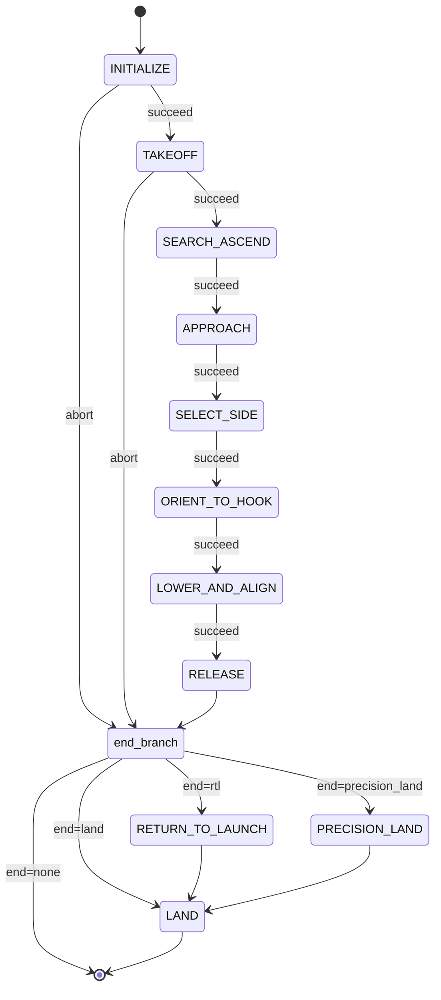

# Hook — SAE Eletroquad 2026 Mission 2

ROS 2 package for the "Hang the Right Wire" mission. The drone takes off from
the arena center, finds the orange sphere mounted on one of two ropes, parks
at a fixed real-world distance from the sphere, picks which side of the rope
to fly along, aligns perpendicular to it, descends on LIDAR, releases the hook
with a servo, and lands.

Built on [Nectar SDK](https://github.com/Black-Bee-Drones/nectar-sdk) (drone +
vision + AI) and [Yasmin](https://github.com/uleroboticsgroup/yasmin) state
machines.

## Hardware

- Drone: custom quadrotor running ArduPilot (GPS pose).
- Camera: Arducam IMX662 USB, 1920×1080, horizontal FOV 86° (diagonal 102°,
  vertical 47°), mounted nadir-pointing.
- Compute: Jetson Orin Nano.
- Hook: hobby servo on RC AUX 3 (`SERVO_CHANNEL = 3`). `HOLD_PWM = 1000`,
  `RELEASE_PWM = 2000`.
- Altitude: TFLuna LIDAR exposed by MAVROS as `rangefinder/rangefinder`. All
  inner-loop altitudes use `AltitudeSource.LIDAR`.

### Body-frame layout (FLU, +x forward, +y left)

Two offset pairs, each consumed by a different code path:

| Constant | Default | Meaning |
|---|---|---|
| `CAMERA_BODY_OFFSET_X_M` | `+0.05` | camera position in body frame from drone center, +x forward |
| `CAMERA_BODY_OFFSET_Y_M` | `-0.03` | camera y offset from drone center, +y left (so −0.03 = 3 cm right) |
| `CAMERA_TO_HOOK_BODY_X_M` | `0.00` | hook position relative to camera in body frame, +x forward |
| `CAMERA_TO_HOOK_BODY_Y_M` | `+0.10` | hook y offset from camera, +y left (so +0.10 = 10 cm left) |

`CAMERA_TO_HOOK_BODY_*` is what `perception.hook_image_offset()` uses to
project the hook into the image. Every controller parks the **hook** (not the
camera nadir) over the rope. `CAMERA_BODY_OFFSET_*` is informational for now.

The Gazebo SDF
([`simulation/worlds/sae_hook_arena.sdf`](simulation/worlds/sae_hook_arena.sdf))
mirrors this layout: down-camera at `relative_to base_link` `(+0.05, −0.03,
−0.04)`, lidar at `(−0.05, 0, −0.05)`, and a non-functional `hook_visual`
cylinder at `(+0.05, +0.07, −0.05)` so the saved JPGs show the hook position.

## Frames and conventions

- Body frame: FLU (`+x` forward, `+y` left, `+z` up).
- Down camera image: `+x` right, `+y` down. The mapping used everywhere is

  ```
  image -y  ->  body +x   (forward)
  image +x  ->  body -y   (right)
  ```

- Mission control loops are velocity-based in `MoveReference.BODY`. There is
  no GPS / position-mode flight inside the inner loops.
- The sphere and the rope are at world height `SPHERE_HEIGHT_M = 1.7 m`.
  Pixel-per-meter is computed at the *target depth* `(altitude − target_height)`,
  not at altitude alone.
- The camera has **anisotropic** pixels-per-meter — the wide-angle lens
  (`HFOV = 86°`, `VFOV = 47°`) gives different focal lengths in image-x
  and image-y. We use `px_per_meter_x()` (HFOV+IMAGE_WIDTH) for image-x ↔
  body-y conversions and `px_per_meter_y()` (VFOV+IMAGE_HEIGHT) for
  image-y ↔ body-x conversions. See [hook/core/perception.py](hook/core/perception.py).
  Helper `image_offset_to_body()` deprojects a 2-D image offset to body
  coordinates; ALIGN's `vx`-driving error uses `ppm_y`, its `vy`-driving
  error uses `ppm_x`.
- All position controllers feed errors in **meters** (`err_px / ppm_axis`),
  not pixels. PID gains are `m/s per m`. This keeps response invariant
  across the altitude range each state spans.

## Strategy (one paragraph)

A single YOLO-seg model (classes `sphere`, `rose`) runs at 960 px on every
loop tick. Each visible piece of rope is its own `rose` instance, which is
what makes side selection possible. We segment, filter per class
(`sphere ≥ 0.70`, `rose ≥ 0.40`, IoU 0.6), then run state-specific control:
ascend until the sphere is debounced; capture an approach bearing once and
fly to a radial setpoint that is `APPROACH_TARGET_DISTANCE_M` real-world
meters short of the sphere (yaw-invariant); descend keeping that line; pick
the longer rope segment as the side and predict the anchor sign from it (no
open-loop body shift); compute the closest yaw rotation `Δ_target` that
makes the rope perpendicular to body +x AND in front of the drone, then
spin to it (sphere-anchored polar-angle PID, vision-only) so ALIGN never
has to back over the rope or land in the wrong half; run the merged
`LOWER_AND_ALIGN` controller — three image-frame PIDs (rope angle, hose
row, sphere anchor) hold a stand-off pose where the rope is `ALIGN_STANDOFF_M`
in front of the hook, then descend on LIDAR with a hard altitude floor at
`RELEASE_ALTITUDE` while the standoff ramps to 0 and the sphere anchor is
dropped (vy=0, hose-only) whenever the sphere is missing or its target
walks off the FOV; servo the hook; RTL + land.

## State machine

`mangalarga.py::build_sm` constructs the SM from the `STAGES` registry in
[hook/states/__init__.py](hook/states/__init__.py). With `--stages` the
pipeline is truncated to a contiguous prefix; the end-branch is configured by
`--end {rtl|land|none}`. ABORT and SUCCEED both flow into the end-branch.



| State            | Stage name        | File                                                                  | What it does |
|------------------|-------------------|-----------------------------------------------------------------------|--------------|
| INITIALIZE       | (prefix)          | [hook/core/states.py](hook/core/states.py)                            | Build `MavrosDrone` (SITL or GPS), open camera (`/down_camera/compressed` in sim, OpenCV otherwise), load segmentor, build per-class confidence filter. |
| TAKEOFF          | (prefix)          | [hook/core/states.py](hook/core/states.py)                            | Arm + take off to `INITIAL_TAKEOFF_ALTITUDE`. |
| SEARCH_ASCEND    | `search_ascend`   | [hook/states/search_and_ascend.py](hook/states/search_and_ascend.py)  | Two-phase. `ascend`: rise at `ASCEND_VELOCITY` until `ASCENT_STOP_CONFIRMATIONS` consecutive sphere detections OR altitude reaches `MAX_ASCEND_ALTITUDE`. `yaw_search`: at the cap, stop climbing and rotate at `ASCEND_YAW_RATE_RAD_S` until the same debounce fires. Same SUCCEED path in both phases; `ASCENT_TIMEOUT` bounds the whole state. Covers the case where the takeoff yaw leaves the sphere outside the camera frustum. |
| APPROACH         | `approach`        | [hook/states/approach_sphere.py](hook/states/approach_sphere.py)      | Step 1 (lateral): capture bearing unit `(ux0, uy0)` over `APPROACH_INIT_BEARING_FRAMES` detections; two metric PIDs drive the sphere onto a radial setpoint at `APPROACH_TARGET_DISTANCE_M`. Step 2 (descent): same PIDs while descending at `APPROACH_DESCEND_VELOCITY` until `LIDAR ≤ WORK_ALTITUDE`. Stores `approach_bearing_unit` and `approach_image_offset`. |
| SELECT_SIDE      | `select_side`     | [hook/states/select_hose_side.py](hook/states/select_hose_side.py)    | Decision-only (no movement). Sample `SIDE_SAMPLE_FRAMES` frames; lock rope long-axis from the most-confident `rose`; bucket each `rose` instance by sign of its centroid projection onto that axis from the sphere; pick side with greater accumulated long-axis length. Tie (`ratio < SIDE_LENGTH_RATIO`) → fallback to side anti-aligned with `approach_image_offset`. Stores `hose_side_image_unit` and `anchor_sign` (predicted from sign of `side_unit.x`). |
| ORIENT_TO_HOOK   | `orient_to_hook`  | [hook/states/orient_to_hook.py](hook/states/orient_to_hook.py)        | Predictive yaw, vision-only, anisotropic-correct. Sample `ORIENT_SAMPLE_FRAMES` good frames; per frame compute `Δ = predict_orient_yaw(side_unit, sphere_xy, ppm_x, ppm_y)` — the closest **body** yaw that makes the rope horizontal in image AND keeps the sphere in the upper half. Vector-mean across frames. If `\|Δ\| < ORIENT_SKIP_THRESHOLD_RAD`: SUCCEED with no rotation. Otherwise spin: PID drives the cumulative body yaw (computed from the sphere's body-frame polar angle, anisotropic-deprojected) to `Δ_target`. Converges when `\|err\| < ORIENT_ANGLE_TOLERANCE_RAD` for `ORIENT_CONFIRMATIONS` frames. On success rotates `hose_side_image_unit` by the OBSERVED body-yaw delta (anisotropic image transformation) and refreshes `anchor_sign` so `LOWER_AND_ALIGN` sees the post-spin body frame transparently. Sphere-loss tolerant (holds last `vyaw` for up to `ORIENT_MAX_LOST_FRAMES` frames). |
| LOWER_AND_ALIGN  | `lower_and_align` | [hook/states/lower_and_align.py](hook/states/lower_and_align.py)      | Three image-frame PIDs (rope angle → `vyaw`; hose row → `vx`; sphere anchor → `vy`) plus a symmetric `vz` controller around `RELEASE_ALTITUDE` during the descent phase, all on the same controller stack. Three internal phases: `yaw` (only `vyaw` while `\|angle\| > ALIGN_YAW_FIRST_TOLERANCE_DEG`), `align` (full `(vx, vy, vyaw)` with `standoff = ALIGN_STANDOFF_M`, `vz = 0`; exits to descend after `HOSE_ALIGN_CONFIRMATIONS` ticks within tol), and `descend` (same controllers; standoff ramps `ALIGN_STANDOFF_M → 0` over `DESCEND_STANDOFF_RAMP_TICKS`; `vz = -clip(DESCEND_VZ_KP·(alt − RELEASE_ALTITUDE), VZ_MIN, VZ_MAX) · sign(alt − RELEASE_ALTITUDE)` with a `±RELEASE_ALTITUDE_TOLERANCE_M` deadband — drone climbs back into the band if it undershoots; SUCCEED on `\|alt − RELEASE_ALTITUDE\| ≤ RELEASE_ALTITUDE_TOLERANCE_M` AND lateral/angle within tol for `DESCEND_RELEASE_CONFIRMATIONS` frames). Sphere-loss fallback (uniform across phases): if the sphere is missing OR `target_sphere_cx` leaves `[DESCEND_SPHERE_TARGET_MARGIN_PX, IMAGE_WIDTH − margin]`, the anchor PID is disabled (`vy = 0`, `anchor_ok = True`) and `pick_hose_by_dir` falls back to the most-confident `rose`. Sphere loss does NOT abort. Chosen-rope loss escalates: at `LOWER_RECOVERY_LOST_FRAMES` consecutive misses the state commands `+LOWER_RECOVERY_VZ` (climb) instead of descending/hovering to widen the FOV; at `LOWER_MAX_LOST_FRAMES` it aborts. |
| RELEASE          | `release`         | [hook/states/release_hook.py](hook/states/release_hook.py)            | Stop motion, drive `SERVO_CHANNEL` from `HOLD_PWM` to `RELEASE_PWM`. |
| RETURN_TO_LAUNCH | (suffix)          | [hook/core/states.py](hook/core/states.py)                            | `drone.rtl(altitude=RTL_ALTITUDE, method=NAVIGATE, land=False)`. |
| PRECISION_LAND   | (suffix)          | [hook/states/precision_land.py](hook/states/precision_land.py)        | Three phases. `rtl`: `move_to(0, 0, PRECISION_LAND_RTL_ALTITUDE)` against TAKEOFF reference via PID_EKF. `align`: hover at RTL altitude, drive the blue-base centroid (class 7 from `best_7_class.pt`) onto the image center with two metric P-controllers until `\|err\| < PRECISION_LAND_TOL_M` for `PRECISION_LAND_INIT_CONFIRMATIONS` frames. `descend`: `vz = -clip(VZ_KP·(alt - target), 0, VZ_MAX)` toward `PRECISION_LAND_TARGET_ALTITUDE` while xy stays centered; SUCCEED when `alt ≤ target + ALT_TOLERANCE_M` AND `\|err\| < PRECISION_LAND_TOL_M` for `PRECISION_LAND_LAND_CONFIRMATIONS` frames. Hands off to `LAND` for the actual touchdown; ABORT routes to `LAND` so the drone always lands. |
| LAND             | (suffix)          | [hook/core/states.py](hook/core/states.py)                            | `drone.land()` then close camera. |

## APPROACH — radial setpoint, metric PIDs, safety

- **Radial setpoint.** On the first `APPROACH_INIT_BEARING_FRAMES` good
  detections the median image-frame bearing is deprojected to a
  **body-frame** unit vector and frozen on the blackboard. Each tick the
  setpoint is reconstructed at current altitude with anisotropic ppm:

  ```
  ppm_x = px_per_meter_x(alt, SPHERE_HEIGHT_M)
  ppm_y = px_per_meter_y(alt, SPHERE_HEIGHT_M)
  setpoint_x = ICX − D · body_bearing.y · ppm_x + hook_image_offset.x
  setpoint_y = ICY − D · body_bearing.x · ppm_y + hook_image_offset.y
  ```

  This puts the **hook** on the world line *takeoff → sphere*, exactly
  `APPROACH_TARGET_DISTANCE_M` short of the sphere, regardless of yaw
  AND regardless of the lens's FOV asymmetry. See
  [`approach_setpoint`](hook/core/perception.py).

- **Metric PIDs.** Two SDK `PIDController`s (`pid_x`, `pid_y`) feed on
  `err_px / ppm` so the response to a real-world error is the same at any
  altitude. Gain `APPROACH_KP_M = 0.80 m/s per m`. Output deadband =
  `PID_MIN_OUTPUT_VELOCITY_XY` (suppresses sub-noise commands). Output clamp
  `±APPROACH_MAX_VELOCITY_XY`. An error deadband (`err_m < APPROACH_TOL_M`)
  zeros the command and resets both PIDs.

- **Bearing-skip threshold.** If the very first detection is closer than
  `APPROACH_MIN_INIT_DIST_M` (real meters), the bearing is set to `(0, 0)`
  and the descent goes straight down.

- **Safety (`_enforce_safety`).** If the live sphere distance from the camera
  nadir is below `APPROACH_MIN_SAFE_DISTANCE_M`, the toward-sphere component
  of `(vx, vy)` is stripped; perpendicular and away motion is preserved.

- **Step-2 altitude floor.** The main path exits via SUCCEED the moment
  `altitude ≤ WORK_ALTITUDE`. The no-pose blind-descent fallback also
  respects that floor (`vz = 0` below it).

- **Saved overlay** (per frame, `~/sae2026/<ts>/approach_sphere/`):
  segmentation masks (custom palette + polygon outline + label chip), cyan
  `+` at image center, red dot at sphere centroid, magenta line cyan→sphere
  with live distance (m + px), yellow circle of radius `APPROACH_TOL_M·ppm`
  at the drone target, green error arrow, top-left HUD with `alt`, `D`,
  `ppm`, error in m and px, and live `vx vy vz`.

## ORIENT_TO_HOOK — predictive yaw to perpendicular-and-in-front

`LOWER_AND_ALIGN`'s three controllers are **180°-symmetric** about the
chosen rope axis: rope angle = 0 (horizontal in image),
`hose_cy = IMAGE_CENTER_Y − ALIGN_STANDOFF_M·ppm` (rope
`ALIGN_STANDOFF_M` in front), and
`sphere_cx = IMAGE_CENTER_X + anchor_sign·SPHERE_ANCHOR_DISTANCE_M·ppm`
are all satisfied at **both** yaws — rope-in-front AND rope-behind, and
the rope-angle PID picks whichever rotation is shorter, which can leave
the drone in the wrong half. This state computes the closest yaw that
puts the rope perpendicular **and** in front, vision-only, in a single
shot.

- **Predictive math** (closed-form, anisotropic-correct — see
  [`predict_orient_yaw`](hook/core/perception.py)). Both `ppm_x` and
  `ppm_y` are required so the image-frame inputs are deprojected to
  body frame before the geometric reasoning:

  ```
  bs   = (-(sy-cy)/ppm_y, -(sx-cx)/ppm_x)     # sphere body coords
  rb   = (-uy/ppm_y, -ux/ppm_x)               # rope direction in body
  Δ_a  = atan2(-rb.x, rb.y)                   # body yaw → rope along ±body_y
  Δ_b  = Δ_a + π
  ```

  The rope ends up in front of the drone (body +x positive) iff
  `cos(Δ)·bs.x + sin(Δ)·bs.y > 0`. That sign picks between Δ_a and
  Δ_b; the result is wrapped to `(−π, π]`. **Body yaw**, not image
  rotation — the two are no longer the same with the lens's anisotropic
  FOV, and the body yaw is what the drone's vyaw command actually
  produces.

- **Sample phase.** `ORIENT_SAMPLE_FRAMES` good frames (sphere AND chosen
  rope visible). The chosen rope's `axis_unit` is sign-aligned with the
  blackboard's `hose_side_image_unit` so the sign is consistent across
  frames. Per frame `Δ` is computed by `predict_orient_yaw`. Vector-mean
  over `(cosΔ, sinΔ)` yields a wrap-safe `Δ_target`.

- **Skip path.** If `|Δ_target| < ORIENT_SKIP_THRESHOLD_RAD` (default
  5°): SUCCEED with no rotation. `hose_side_image_unit` and
  `anchor_sign` stay untouched. The working
  `drone_yaw_deg ∈ {±90, −45}` cases for an in-front rope land here.

- **Spin phase.** Feedback is the sphere's **body-frame** polar angle
  derived from its image position by anisotropic deprojection:

  ```
  phi(t) = atan2(body_y(t), body_x(t))
         = atan2(-(sx(t)-cx)/ppm_x, -(sy(t)-cy)/ppm_y)
  ```

  When the body yaws CCW by Δ (a pure rotation of the body frame around
  the camera nadir), the world point's body coords transform by R(−Δ)
  and `phi` decreases by exactly Δ. So the cumulative body-yaw
  observed during the spin is `wrap_pi(phi_initial − phi_current)`,
  which we drive to `Δ_target`. This is invariant to `ppm_y/ppm_x` —
  the image-frame polar angle is **not** (it gets warped by the
  anisotropic projection during the rotation).

  Converges when the wrapped error stays under
  `ORIENT_ANGLE_TOLERANCE_RAD` for `ORIENT_CONFIRMATIONS` consecutive
  frames.

- **Sphere-loss robustness.** If `best_sphere` returns None for one tick,
  the last commanded `vyaw` is held. Aborts only after
  `ORIENT_MAX_LOST_FRAMES` consecutive misses or `ORIENT_TIMEOUT`
  seconds. Hose tracking is **not** required during the spin.

- **Commit.** On convergence, the OBSERVED body-yaw delta is used (not
  the commanded one — robust to the ±`ORIENT_ANGLE_TOLERANCE_RAD` PID
  tolerance) and `hose_side_image_unit` is rotated by the corresponding
  **anisotropic image-frame transformation** via
  [`rotate_image_vector_under_body_yaw`](hook/core/perception.py):

  ```python
  delta_actual = wrap_pi(phi_initial - phi_final)
  blackboard["hose_side_image_unit"] = rotate_image_vector_under_body_yaw(
      side_unit, delta_actual, ppm_x, ppm_y,
  )
  blackboard["anchor_sign"] = anchor_sign_for_side(new_side_unit)
  ```

  Reduces to the old `R(Δ)·side_unit` when `ppm_x == ppm_y`.

- **Saved overlay** (per frame, `~/sae2026/<ts>/orient_to_hook/`): cyan
  `+` at image center, red dot at live sphere, yellow chosen-rope
  axis when available, HUD with `phase` (`sample`/`spin`),
  `delta_tgt` (predicted body yaw), and `err` (live body-yaw error
  during the spin). Convergence is "rope axis horizontal AND sphere
  upper half".

## LOWER_AND_ALIGN — sphere-anchored stand-off + LIDAR descent

Single state, single PID stack, three internal phases. Replaces the
previous separate `ALIGN_TO_HOSE` and `DESCEND_AND_ALIGN` states.

- **Phase 1 (`yaw`).** While `|rope_angle| > ALIGN_YAW_FIRST_TOLERANCE_DEG`,
  only `vyaw` runs and the position PIDs are reset. `hose_cy` and
  `sphere_cx` are not geometrically meaningful until the rope is close
  to horizontal.
- **Phase 2 (`align`).** Full `(vx, vy, vyaw)` PIDs with
  `standoff = ALIGN_STANDOFF_M`, `vz = 0`. The drone parks at a stand-off
  pose where the rope is held `ALIGN_STANDOFF_M` in front of the hook
  (image upper half), the sphere is anchored at `SPHERE_ANCHOR_DISTANCE_M`
  from the hook along the chosen rope direction
  (image x offset = `anchor_sign · D`), and the rope is horizontal in
  image (drone perpendicular). Exits to phase 3 when angle/center/anchor
  errors all stay within tolerance for `HOSE_ALIGN_CONFIRMATIONS` ticks.
- **Phase 3 (`descend`).** Same controllers; `standoff` linearly ramps
  `ALIGN_STANDOFF_M → 0` over `DESCEND_STANDOFF_RAMP_TICKS` ticks so the
  rope target slides under the hook smoothly. Vertical command is a
  symmetric P controller around `RELEASE_ALTITUDE` with a deadband:

  ```
  err = altitude - RELEASE_ALTITUDE
  vz = 0                                                      if |err| ≤ RELEASE_ALTITUDE_TOLERANCE_M
  vz = -sign(err) · clip(DESCEND_VZ_KP·|err|, VZ_MIN, VZ_MAX) otherwise
  ```

  Bidirectional on purpose: if a lidar glitch, wind kick, or hose-only
  drift pulls the drone below the floor while it is still chasing
  lateral/yaw, the controller commands positive `vz` to climb back into
  the band rather than ride down. SUCCEED on
  `|altitude − RELEASE_ALTITUDE| ≤ RELEASE_ALTITUDE_TOLERANCE_M` AND
  lateral/angle within tolerance for `DESCEND_RELEASE_CONFIRMATIONS`
  frames.

Wiring (image-to-body: `image -y → body +x`, `image +x → body -y`;
anisotropic ppm — see top of README):

```
vx   ← pid_center.update((hose_cy - target_hose_cy) / ppm_y)   # image-y → body-x
vy   ← pid_anchor.update((sphere_cx - target_sphere_cx) / ppm_x)  # image-x → body-y
vyaw ← pid_yaw.update(angle_deg)
```

`anchor_sign` is set in `SELECT_SIDE` from `sign(side_unit.x)` and
refreshed by `ORIENT_TO_HOOK` after the yaw rotation. The merged state
reads it without modification.

**Sphere-loss fallback (uniform across all phases)** — what makes this
robust to mid-mission detector drops:

- If `best_sphere(result)` is `None` OR `target_sphere_cx` falls outside
  `[DESCEND_SPHERE_TARGET_MARGIN_PX, IMAGE_WIDTH − margin]`: disable the
  anchor PID, set `vy = 0`, mark `anchor_ok = True`.
- The chosen rope falls back to the most-confident `rose` instance
  (`hose_segments(result)[0]`) when `pick_hose_by_dir` returns None — at
  low altitude the wrong rope is well outside the camera frustum, so the
  remaining detection is necessarily the chosen one.
- Sphere loss does **not** abort. Chosen-rope loss escalates in two
  steps: at `LOWER_RECOVERY_LOST_FRAMES` consecutive misses the
  controller overrides descent/hover with `vz = +LOWER_RECOVERY_VZ`
  (climb) to widen the FOV until detection returns; at
  `LOWER_MAX_LOST_FRAMES` it aborts. Triggered by chosen-rope loss only
  — sphere-only loss continues running the hose-only references at
  whatever `vz` the descent controller chooses.

## Visualization

Every saved frame uses the shared composite drawers in
[hook/core/overlay.py](hook/core/overlay.py):

- `annotate_seg(frame, result)` — high-contrast palette (cyan / magenta /
  lime / yellow), mask fill at low opacity, polygon outline, label chip with
  black text. Replaces the SDK's default `draw_segmentations` whose default
  palette blends with the rope's red.
- Per-state composite drawers (`draw_search_ascend`, `draw_select_side`,
  `draw_orient`, `draw_lower_and_align`) add controller geometry: image
  center (cyan `+`), hook image projection (magenta `+`), detected hose
  axis (yellow line), target hose row (green dashed line + tolerance
  band), target sphere position (yellow ring + tilted cross, drawn red
  when out of FOV margin), detected sphere centroid (red dot), error
  arrows, the right-edge altitude bar with the release marker, and a
  left HUD (state + phase + alt + ppm, errors in m and px, commanded
  velocities) plus a right HUD (`anchor_sign`, `standoff_m`, tolerances,
  release altitude).
- APPROACH keeps its own bespoke radial-bearing overlay; the segmentation
  layer is the same `annotate_seg`.

Frames are saved every tick (no skipping) under
`DETECTION_SAVE_PATH/<ts>/<state>/`.

## Live mission monitoring

Every state's annotated frame (the same image written to disk) is also
published on a single compressed-image topic:

```bash
ros2 run rqt_image_view rqt_image_view /hook/mission/image
ros2 topic hz /hook/mission/image/compressed
```

Topic + JPEG quality are configured in
[hook/core/constants.py](hook/core/constants.py)
(`MISSION_FRAME_TOPIC`, `MISSION_FRAME_JPEG_QUALITY`). The publisher is
created once in `INITIALIZE` and shared across all states via the
blackboard. JPEG-encode is skipped while no subscriber is connected so
the publisher costs near zero CPU during normal flight. QoS is
best-effort / depth=1 (live monitoring, not a reliable record — disk
saves remain authoritative).

The shared output object is [`FrameSink`](hook/core/frame_sink.py): each
state creates one with its own ``prefix`` and calls ``sink.emit(frame)``,
which does both ``cv2.imwrite`` and ``publisher.publish``.

## Camera scaling (px <-> m)

Pixel <-> meter conversion lives behind the `CameraScaling` interface in
[hook/core/camera_scaling.py](hook/core/camera_scaling.py). Three
implementations are available; all four perception entry points
(`px_per_meter_x`, `px_per_meter_y`, `image_offset_to_body`,
`hook_image_offset`) delegate to the active singleton, so swapping
methods is a one-line constant change.

| `CAMERA_SCALING_METHOD` | Class | What it uses | Where it's right |
|---|---|---|---|
| `"fov"` (default) | `FOVScaling` | `HORIZONTAL_FOV_DEG` + `IMAGE_WIDTH` for `ppm_x`; `VERTICAL_FOV_DEG` + `IMAGE_HEIGHT` for `ppm_y`. Anisotropic. | Inner ~30% of the image. No calibration needed. |
| `"efl"` | `EFLScaling` | `f_px = CAMERA_EFL_MM * 1000 / CAMERA_PIXEL_SIZE_UM`. Same value on both axes (square pixels). | Image center; closer to the paraxial truth than `fov`. No calibration needed. |
| `"intrinsic"` | `IntrinsicScaling` | Calibrated `K` matrix and distortion vector loaded from `CAMERA_INTRINSIC_K` / `CAMERA_INTRINSIC_DIST`. `cv2.undistortPoints` deprojects pixels to body. | Whole frame, including corners. Requires a one-time chessboard calibration. |

The `intrinsic` placeholders default to `f_px = EFL_mm·1000/pixel_um`
with zero distortion (i.e. equivalent to `efl` until you replace them
with real calibration output), so switching to `"intrinsic"` is safe at
any time — it just provides no extra accuracy until calibrated.

After running ROS `camera_calibration` (or `cv2.calibrateCamera`) on
the actual lens, paste the resulting `K` and distortion coefficients
into [hook/core/constants.py](hook/core/constants.py):

```python
CAMERA_INTRINSIC_K = np.array([
    [fx,  0, cx],
    [ 0, fy, cy],
    [ 0,  0,  1],
], dtype=np.float64)
CAMERA_INTRINSIC_DIST = np.array([k1, k2, p1, p2, k3], dtype=np.float64)
CAMERA_SCALING_METHOD = "intrinsic"
```

### Live evaluator

Hover the drone over a known target (sphere on the rope at 1.7 m, marker
on the floor) and run the evaluator alongside the mission. It runs the
segmentor on every camera frame and, for every detection, prints the
estimated body-frame `(body_x, body_y)` from **all three** methods on
the same image, color-coded — so you can read which line matches the
tape-measured ground truth.

```bash
# floor objects
ros2 run hook scaling_evaluator
# sphere on the hose
ros2 run hook scaling_evaluator --ros-args -p target_height_m:=1.7
# watch
ros2 run rqt_image_view rqt_image_view /hook/scaling_eval/compressed
```

Subscribes to `/mavros/rangefinder/rangefinder` for altitude (override
with `-p rangefinder_topic:=...`); HUD shows altitude, depth, and the
`(ppm_x, ppm_y)` produced by each method.

## Mission entry point

`ros2 run hook mangalarga` parses an argparse CLI on `sys.argv` (after
`rclpy.utilities.remove_ros_args`):

```
--stages all | <name> | <n1>,<n2>,...   # contiguous prefix of STAGES (default all)
--end rtl | land | none                  # what runs after the last stage (default rtl)
--list                                   # print stage names in order and exit
```

Stage names (in mission order): `search_ascend`, `approach`, `select_side`,
`orient_to_hook`, `lower_and_align`, `release`. A multi-name `--stages`
value must equal the first N of that list (no skipping; controllers depend
on blackboard keys set by the previous stage).

End-branch:

- `rtl` (default): `RETURN_TO_LAUNCH → LAND`.
- `land`: `LAND` immediately.
- `precision_land`: `PRECISION_LAND → LAND` — RTL to `(0, 0, PRECISION_LAND_RTL_ALTITUDE)`, then visually align on the blue base (detector model, class 7) and descend with a proportional `vz` (capped at `PRECISION_LAND_VZ_MAX`) until `alt ≤ PRECISION_LAND_TARGET_ALTITUDE + ALT_TOLERANCE_M` AND the lateral error stays under `PRECISION_LAND_TOL_M`. Hands off to `LAND` for touchdown.
- `none`: SM terminates; the drone is left in whatever state the last stage
  finished in. Useful to inspect convergence in sim.

ABORT from any stage routes to the same end-branch. Failures from
`INITIALIZE` and `TAKEOFF` also route there; `RTL`/`LAND` no-op safely if
the drone wasn't created.

## Simulation

Gazebo Harmonic + ArduCopter SITL. The launch file
[launch/sae_hook.launch.py](launch/sae_hook.launch.py) reads the canonical
SDF [simulation/worlds/sae_hook_arena.sdf](simulation/worlds/sae_hook_arena.sdf),
rewrites the iris and sphere `<pose>` tags, writes the result to
`/tmp/sae_hook_arena_*.sdf`, and forwards that path to nectar's
`sitl_gazebo.launch.py`. It also runs an `image_transport republish` node
converting `/down_camera` (raw) → `/down_camera/compressed`.

```bash
# Terminal 1: ArduCopter SITL pointed at Gazebo
make sim-start-gazebo

# Terminal 2: Gazebo + MAVROS + camera republish
ros2 launch hook sae_hook.launch.py

# Terminal 3: mission (sim mode)
HOOK_SIM=1 ros2 run hook mangalarga
```

`HOOK_SIM=1` switches `IMAGE_SOURCE` to `/down_camera/compressed` (subscribed
with `compressed=True`) and the drone config to `SITL_GAZEBO_CONFIG`.

### Launch args

| Arg | Default | Meaning |
|---|---|---|
| `drone_x`, `drone_y` | `0.0`, `0.0` | iris XY at spawn (m). |
| `drone_yaw_deg` | `0.0` | iris yaw at spawn (deg, positive = CCW). |
| `sphere_x`, `sphere_y` | `2.0`, `1.25` | sphere XY (m). Z fixed at `SPHERE_Z = 1.7 m`. |
| `fcu_url` | `tcp://127.0.0.1:5760` | MAVLink URL forwarded to `sitl_gazebo.launch.py`. |

Examples:

```bash
ros2 launch hook sae_hook.launch.py drone_yaw_deg:=45 sphere_x:=-2.5
ros2 launch hook sae_hook.launch.py drone_yaw_deg:=180 sphere_x:=3.5 sphere_y:=1.25
```

### Recipes

```bash
# Stage 1 only, drone facing 90°, sphere at -3 m on hose A
ros2 launch hook sae_hook.launch.py drone_yaw_deg:=90 sphere_x:=-3.0
HOOK_SIM=1 ros2 run hook mangalarga --stages search_ascend --end land

# Stages 1-4, hover at end (no auto RTL/LAND) for inspection
ros2 launch hook sae_hook.launch.py drone_yaw_deg:=180 sphere_x:=2.5
HOOK_SIM=1 ros2 run hook mangalarga --stages search_ascend,approach,select_side,orient_to_hook --end none
```

## Package structure

```
hook/
  hook/
    mangalarga.py             # entry point: argparse + build_sm + run
    core/
      constants.py            # all tunable parameters
      perception.py           # run_seg, best_sphere, hose_segments, hose_pose,
                              # px_per_meter, hook_image_offset, approach_setpoint,
                              # alignment_targets, anchor_sign_for_side, pick_hose_by_dir
      overlay.py              # annotate_seg + per-state composite drawers
      states.py               # Initialize, Takeoff, ReturnToLaunch, Land
    states/
      __init__.py             # STAGES registry (mission order)
      search_and_ascend.py
      approach_sphere.py
      select_hose_side.py
      orient_to_hook.py       # predictive yaw (closest perpendicular + in-front)
      lower_and_align.py      # merged stand-off align + LIDAR descent
      release_hook.py
      precision_land.py       # end-branch: RTL + visual base-aligned descent
  launch/
    sae_hook.launch.py        # Gazebo + MAVROS, drone/sphere pose CLI args
  simulation/worlds/
    sae_hook_arena.sdf        # canonical world (rewritten at launch)
  share/models/               # *.pt model weights (committed)
  package.xml
  setup.py
```

`DETECTION_SAVE_PATH` (`~/sae2026/<ts>/<state>/`) collects per-frame
annotated JPEGs when `SAVE_DETECTIONS = True`. The directory is outside the
repo.

## Parameters (current defaults)

All real-drone values in [hook/core/constants.py](hook/core/constants.py).
Simulation-only overrides in
[hook/core/constants_sim.py](hook/core/constants_sim.py) — imported into
the `constants` namespace when `HOOK_SIM=1`. The override file only
touches controller gains and velocity caps (uniformly ×4 from the
real-drone tuning, preserving the closed-loop shape at ~4× wall-clock
speed) plus `SPHERE_HEIGHT_M`/`RELEASE_ALTITUDE` (rule-book arena
geometry). Confirmation counts, tolerances, distances, output
deadbands, and timeouts stay the same on purpose.

### Altitude
| Name | Value | Used in |
|---|---|---|
| `INITIAL_TAKEOFF_ALTITUDE` | 4.0 m | TAKEOFF |
| `MAX_ASCEND_ALTITUDE` | 6.8 m | SEARCH_ASCEND cap |
| `WORK_ALTITUDE` | 3.0 m | end of APPROACH descent |
| `RELEASE_ALTITUDE` | 2.0 m | center of the symmetric release band in DESCEND (±`RELEASE_ALTITUDE_TOLERANCE_M`) |
| `RTL_ALTITUDE` | 2.7 m | RTL |

### Camera + body layout
| Name | Value |
|---|---|
| `IMAGE_WIDTH × IMAGE_HEIGHT` | 1920 × 1080 |
| `HORIZONTAL_FOV_DEG` / `VERTICAL_FOV_DEG` | 86.0 / 47.0 |
| `CAMERA_BODY_OFFSET_X_M` / `_Y_M` | +0.05 / −0.03 |
| `CAMERA_TO_HOOK_BODY_X_M` / `_Y_M` | 0.00 / +0.10 |
| `SPHERE_HEIGHT_M` | 1.7 |

The metric scaling helpers `px_per_meter_x` / `px_per_meter_y` derive
the per-axis ppm at runtime from the altitude and the corresponding
(FOV, image extent) pair. At `WORK_ALTITUDE = 3.3 m` and
`SPHERE_HEIGHT_M = 1.7 m`, depth is 1.6 m and the values are
`ppm_x ≈ 643 px/m`, `ppm_y ≈ 776 px/m` (factor 1.21 difference). The
hose-row error (image-y) and the standoff target use `ppm_y`; the
sphere-anchor error and target (image-x) use `ppm_x`.

### Segmentation
| Name | Value |
|---|---|
| `SEG_MODEL_PATH` | `share/models/sae-2026-hang-all-yolo26n-seg-v2-960.pt` |
| `SEG_IMGSZ` / `SEG_IOU` | 960 / 0.6 |
| `SPHERE_CONF` / `HOSE_CONF` | 0.70 / 0.40 |
| `SEG_PREDICT_CONF` | `min(SPHERE_CONF, HOSE_CONF)` (passed to `predict`; per-class filter refines) |

### Shared PID deadbands
| Name | Value | Notes |
|---|---|---|
| `PID_MIN_OUTPUT_VELOCITY_XY` | 0.06 m/s | `output_deadband` on every xy PID |
| `PID_MIN_OUTPUT_VYAW` | 0.01 rad/s | `output_deadband` on every yaw PID |

### SEARCH_ASCEND
| Name | Value |
|---|---|
| `ASCEND_VELOCITY` | 0.3 m/s |
| `ASCEND_YAW_RATE_RAD_S` | 0.35 rad/s (yaw-search phase at the cap) |
| `ASCENT_STOP_CONFIRMATIONS` | 20 |
| `ASCENT_TIMEOUT` | 60.0 s |

### APPROACH
| Name | Value |
|---|---|
| `APPROACH_TARGET_DISTANCE_M` | 0.72 m |
| `APPROACH_MIN_SAFE_DISTANCE_M` | 0.50 m |
| `APPROACH_KP_M` | 0.80 m/s per m |
| `APPROACH_TOL_M` | 0.10 m |
| `APPROACH_CONFIRMATIONS` | 8 |
| `APPROACH_MAX_VELOCITY_XY` | 0.28 m/s |
| `APPROACH_INIT_BEARING_FRAMES` | 3 |
| `APPROACH_MIN_INIT_DIST_M` | 0.12 m |
| `APPROACH_DESCEND_VELOCITY` | 0.20 m/s |
| `APPROACH_TIMEOUT` | 90 s |
| `APPROACH_MAX_LOST_FRAMES` | 50 |

### SELECT_SIDE
| Name | Value |
|---|---|
| `SIDE_SAMPLE_FRAMES` | 20 |
| `SIDE_LENGTH_RATIO` | 1.4 |
| `SIDE_TIMEOUT` | 30.0 s |

### ORIENT_TO_HOOK
| Name | Value |
|---|---|
| `ORIENT_SAMPLE_FRAMES` | 6 |
| `ORIENT_SKIP_THRESHOLD_RAD` | `math.radians(5.0)` |
| `ORIENT_YAW_KP` | 0.6 rad/s per rad |
| `ORIENT_MAX_YAW_VELOCITY` | 0.42 rad/s |
| `ORIENT_ANGLE_TOLERANCE_RAD` | `math.radians(12.0)` |
| `ORIENT_CONFIRMATIONS` | 5 |
| `ORIENT_TIMEOUT` | 65.0 s |
| `ORIENT_MAX_LOST_FRAMES` | 60 |

### LOWER_AND_ALIGN
The merged state reuses one set of `HOSE_*` / `SPHERE_ANCHOR_*` PID gains
in both `align` and `descend` phases (per the user's "same control"
requirement); only the standoff target and `vz` change between phases.

| Name | Value |
|---|---|
| `HOSE_MIN_CONTOUR_AREA` | 200 px² |
| `HOSE_ANGLE_TOLERANCE_DEG` / `HOSE_ANGLE_KP` / `HOSE_ANGLE_MAX_VELOCITY` | 5.0° / 0.0098 rad/s/° / 0.28 rad/s |
| `HOSE_CENTER_TOLERANCE_M` / `HOSE_CENTER_KP` / `HOSE_CENTER_MAX_VELOCITY` | 0.050 m / 0.80 m/s/m / 0.25 m/s |
| `SPHERE_ANCHOR_DISTANCE_M` / `SPHERE_ANCHOR_TOLERANCE_M` / `SPHERE_ANCHOR_KP` | 0.5 m / 0.055 m / 0.66 m/s/m |
| `ALIGN_STANDOFF_M` | 0.30 m |
| `ALIGN_YAW_FIRST_TOLERANCE_DEG` | 18.0° |
| `HOSE_ALIGN_CONFIRMATIONS` | 8 (align→descend transition) |
| `HOSE_ALIGN_TIMEOUT` | 100 s (align phase only) |
| `LOWER_MAX_LOST_FRAMES` | 60 (counts ONLY chosen-rope losses; abort threshold) |
| `LOWER_RECOVERY_LOST_FRAMES` | 20 (counts ONLY chosen-rope losses; climb-up threshold) |
| `LOWER_RECOVERY_VZ` | 0.10 m/s (positive vz during the climb-recovery) |
| `DESCEND_VZ_KP` / `DESCEND_VZ_MIN` / `DESCEND_VZ_MAX` | 0.20 / 0.05 / 0.20 m/s |
| `RELEASE_ALTITUDE_TOLERANCE_M` | 0.15 m (release succeeds inside this band around `RELEASE_ALTITUDE`) |
| `DESCEND_STANDOFF_RAMP_TICKS` | 30 |
| `DESCEND_SPHERE_TARGET_MARGIN_PX` | 100 |
| `DESCEND_RELEASE_CONFIRMATIONS` | 5 |
| `DESCEND_TIMEOUT` | 120 s (descend phase only) |

### PRECISION_LAND
| Name | Value | Notes |
|---|---|---|
| `PRECISION_LAND_MODEL_PATH` | `share/models/best_7_class.pt` | 8-class detector; only class 7 (blue base) is consumed |
| `PRECISION_LAND_CLASS_ID` | `7` | blue base |
| `PRECISION_LAND_CONF` / `PRECISION_LAND_IOU` / `PRECISION_LAND_IMGSZ` | 0.25 / 0.5 / 960 | |
| `PRECISION_LAND_RTL_ALTITUDE` | 4.0 m | altitude held during the `rtl` and `align` phases |
| `PRECISION_LAND_TARGET_ALTITUDE` | 0.6 m | descent target; LAND is fired once `alt ≤ target + ALT_TOLERANCE_M` |
| `PRECISION_LAND_ALT_TOLERANCE_M` | 0.15 m | altitude band around `TARGET_ALTITUDE` for the SUCCEED check |
| `PRECISION_LAND_BASE_HEIGHT_M` | 0.0 m | base is flat on the ground; ppm uses target depth = altitude |
| `PRECISION_LAND_KP` / `PRECISION_LAND_MAX_VELOCITY_XY` | 0.32 m/s/m / 0.18 m/s | lateral P-controllers |
| `PRECISION_LAND_TOL_M` | 0.24 m | lateral alignment band (both phases) |
| `PRECISION_LAND_INIT_CONFIRMATIONS` | 5 | align → descend transition |
| `PRECISION_LAND_LAND_CONFIRMATIONS` | 5 | descend → SUCCEED transition |
| `PRECISION_LAND_VZ_KP` / `PRECISION_LAND_VZ_MAX` | 0.20 m/s/m / 0.17 m/s | proportional descent capped at 0.17 m/s |
| `PRECISION_LAND_MAX_LOST_FRAMES` | 60 | base-loss tolerance per phase before ABORT |
| `PRECISION_LAND_TIMEOUT` | 120 s | per-phase timeout |

### Servo
| Name | Value |
|---|---|
| `SERVO_CHANNEL` / `HOLD_PWM` / `RELEASE_PWM` | 3 / 1000 / 2000 |

### Saving / sim
| Name | Value |
|---|---|
| `SAVE_DETECTIONS` | True |
| `DETECTION_SAVE_PATH` | `~/sae2026` |
| `SIM_MODE` | `os.environ.get("HOOK_SIM", "0") == "1"` |
| `SIM_IMAGE_SOURCE` | `/down_camera/compressed` |
| `SIM_IMAGE_COMPRESSED` | True |

### Tuning notes

| Symptom | Knob |
|---|---|
| Drone parks too close to sphere | raise `APPROACH_TARGET_DISTANCE_M` and/or `APPROACH_MIN_SAFE_DISTANCE_M`. |
| APPROACH oscillates around the band | raise `APPROACH_TOL_M`; check `PID_MIN_OUTPUT_VELOCITY_XY` covers MAVROS noise. |
| APPROACH slow at long range | raise `APPROACH_KP_M` and/or `APPROACH_MAX_VELOCITY_XY`. |
| LOWER_AND_ALIGN never exits yaw-first | lower `ALIGN_YAW_FIRST_TOLERANCE_DEG` (more time in yaw-only) or raise it (switch to full sooner). |
| LOWER_AND_ALIGN drifts around the rope | raise `HOSE_CENTER_TOLERANCE_M` / `SPHERE_ANCHOR_TOLERANCE_M`; tune their `*_KP`. |
| ORIENT_TO_HOOK skips when it should spin | lower `ORIENT_SKIP_THRESHOLD_RAD` (default 5°). Verify `predict_orient_yaw` against the failing setup with `tools/visualize_orient.py`. |
| ORIENT_TO_HOOK overshoots / oscillates near target | lower `ORIENT_YAW_KP` or `ORIENT_MAX_YAW_VELOCITY`; raise `ORIENT_ANGLE_TOLERANCE_RAD` if jitter near target prevents exit. |
| ORIENT_TO_HOOK aborts on sphere loss | raise `ORIENT_MAX_LOST_FRAMES`; verify segmentor sphere recall under motion blur during fast yaw. |
| Descend phase crosses the rope at the start | raise `DESCEND_STANDOFF_RAMP_TICKS` (slower ramp) or lower `HOSE_CENTER_KP`. |
| Descent too fast near release | lower `DESCEND_VZ_MIN` or `DESCEND_VZ_MAX`. |
| Mission gives up too early during dropouts | raise `APPROACH_MAX_LOST_FRAMES` / `LOWER_MAX_LOST_FRAMES`. Sphere loss alone never aborts LOWER_AND_ALIGN; if you see one, the chosen rope is also gone. |
| LOWER_AND_ALIGN climbs back up unnecessarily on brief drop-outs | raise `LOWER_RECOVERY_LOST_FRAMES` (defer the climb-recovery) and/or `LOWER_RECOVERY_VZ` if the climb is too aggressive. |
| LOWER_AND_ALIGN never releases / hovers in the band | check that the lateral/angle/anchor PIDs settle inside their tolerances during the time the lidar holds inside `±RELEASE_ALTITUDE_TOLERANCE_M`. Raise `RELEASE_ALTITUDE_TOLERANCE_M` if the lidar noise floor is wider than 15 cm. |
| LOWER_AND_ALIGN keeps climbing back into the band and the descent bobs | the lateral PIDs aren't converging at the release altitude. Raise `HOSE_CENTER_TOLERANCE_M` / `SPHERE_ANCHOR_TOLERANCE_M`, or lower `DESCEND_VZ_KP` so the controller spends more time in the band. |
| SEARCH_ASCEND aborts after the cap (sphere never enters frame) | lower `ASCEND_YAW_RATE_RAD_S` if the rotation is blurring detections; raise `ASCENT_TIMEOUT` if the yaw-search just needs more time. Check the segmentor recall under motion blur. |

## Models

`share/models/sae-2026-hang-all-yolo26n-seg-v2-960.pt` — combined YOLO11n-seg
trained on classes `sphere` and `rose`. Best thresholds: `sphere=0.70`,
`rose=0.40`, `iou=0.6`, `imgsz=960`. Model card:
[blackbeedrones/sae-2026-hang-all-yolo26n-seg-v2-960](https://huggingface.co/blackbeedrones/sae-2026-hang-all-yolo26n-seg-v2-960/blob/main/SUMMARY.md).

`share/models/best_7_class.pt` — 8-class YOLO detector. The `PRECISION_LAND`
state consumes class `7` (blue takeoff/return base) only; all other class
IDs are ignored. Replace with a base-only model when one is available — the
state reads ``PRECISION_LAND_CLASS_ID`` and ``PRECISION_LAND_MODEL_PATH``
from [hook/core/constants.py](hook/core/constants.py).

The paths are resolved at runtime via
`get_package_share_directory("hook") / "models" / ...`. The weights files
are committed to git (see `.gitignore` at the SAE-2026 repo root).

## Build / install

```bash
cd ~/ros2_ws
colcon build --packages-select hook
source install/setup.bash
```

Console scripts (`setup.py` `entry_points`):

| Command | Function |
|---|---|
| `ros2 run hook mangalarga` | `hook.mangalarga:main` |

## Dependencies

Declared in [package.xml](package.xml):

- `rclpy`
- `nectar`, `nectar_interfaces` — drone (MAVROS), vision, AI.
- `yasmin`, `yasmin_ros`, `yasmin_viewer` — state machine.
- ROS 2 (tested on Humble). Ultralytics + supervision are pulled in by
  Nectar for the segmentor.

## References

- [SAE Eletroquad 2026 rules](../Regulamento_EletroQuad_2026_portugues.pdf)
- [Nectar SDK README](https://github.com/Black-Bee-Drones/nectar-sdk/blob/main/README.md)
- [Executor-safe spin fix results](docs/EXECUTOR_FIX_RESULTS.md) — empirical Pattern A / Pattern B verification of the SDK's `BaseDrone._wait` helper that lets the hook state loops run without per-iter `rclpy.spin_once`
