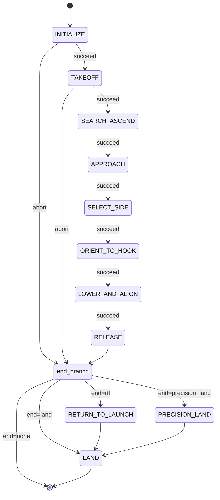

# Hook — SAE EletroQuad 2026 Mission 2

ROS 2 package for **Hang the Right Wire**. The drone takes off from the arena center, finds the orange sphere on one of two ropes, parks the hook a fixed distance from it, picks the longer rope side, yaws until the hose is perpendicular and in front, descends on lidar, releases the hook with a servo, and lands.

Built on [Nectar SDK](https://github.com/Black-Bee-Drones/nectar-sdk) and [Yasmin](https://github.com/uleroboticsgroup/yasmin). Portuguese Jetson runbook: [exec.md](exec.md).

## Hardware

- ArduPilot quadrotor, GPS pose (`PoseSource.GPS`). Sim uses Nectar `SITL_GAZEBO_CONFIG`.
- Camera: Arducam IMX662 USB, 1920×1080, HFOV 86° / VFOV 47°, nadir.
- Compute: Jetson Orin Nano (TensorRT `.engine` in `SEG_MODEL_PATH`).
- Hook servo on RC AUX 3: `HOLD_PWM=1000`, `RELEASE_PWM=2000`.
- Altitude: TFLuna on MAVROS `rangefinder/rangefinder`. Inner loops use `AltitudeSource.LIDAR`.
- Body FLU. Controllers park the **hook**, not the camera: `CAMERA_BODY_OFFSET_* = (0.03, −0.03)` m, `CAMERA_TO_HOOK_BODY_* = (0.00, 0.09)` m.

## Strategy

One YOLO-seg model (classes `sphere`, `rose`, imgsz 960) runs every tick. Each visible rope piece is its own `rose` instance, which is how side selection works. Filter `sphere ≥ 0.70`, `rose ≥ 0.40`, IoU 0.6. Then: climb until the sphere is debounced (yaw search at the altitude cap if needed); freeze a body bearing and park the hook `APPROACH_TARGET_DISTANCE_M` short of the sphere, then descend to work altitude; pick the longer `rose` arm; yaw so the rope is perpendicular and in front; stand-off PIDs (angle, hose row, sphere anchor) then lidar descent to `RELEASE_ALTITUDE`; servo; RTL / land.

Pixel to meter conversion is anisotropic (`px_per_meter_x` / `px_per_meter_y` from FOV). All position PIDs take errors in meters. Inner loops are body-frame velocity (`MoveReference.BODY`). Details live in [`hook/core/perception.py`](hook/core/perception.py) and [`hook/core/constants.py`](hook/core/constants.py).

## State machine

[`mangalarga.py`](hook/mangalarga.py) builds INITIALIZE → TAKEOFF → a contiguous prefix of `STAGES` → end branch. ABORT and SUCCEED both enter the end branch.



| State | Stage | File | Role |
|---|---|---|---|
| INITIALIZE | prefix | [core/states.py](hook/core/states.py) | `MavrosDrone`, camera, segmentor, per class filter, frame publisher |
| TAKEOFF | prefix | [core/states.py](hook/core/states.py) | Arm and take off to `INITIAL_TAKEOFF_ALTITUDE` |
| SEARCH_ASCEND | `search_ascend` | [search_and_ascend.py](hook/states/search_and_ascend.py) | Climb until sphere debounce; at `MAX_ASCEND_ALTITUDE` stop climb and yaw search |
| APPROACH | `approach` | [approach_sphere.py](hook/states/approach_sphere.py) | Freeze bearing; park hook at 0.75 m; descend to `WORK_ALTITUDE` |
| SELECT_SIDE | `select_side` | [select_hose_side.py](hook/states/select_hose_side.py) | No motion. Longer `rose` arm wins; fallback if length ratio `< 1.4` |
| ORIENT_TO_HOOK | `orient_to_hook` | [orient_to_hook.py](hook/states/orient_to_hook.py) | Closest body yaw that puts the rope perpendicular and in front |
| LOWER_AND_ALIGN | `lower_and_align` | [lower_and_align.py](hook/states/lower_and_align.py) | Phases `yaw` / `align` / `descend`. Sphere loss → hose only (`vy=0`); chosen rope loss → climb recovery then abort |
| RELEASE | `release` | [release_hook.py](hook/states/release_hook.py) | Stop, servo HOLD → RELEASE PWM |
| RETURN_TO_LAUNCH | suffix | [core/states.py](hook/core/states.py) | `rtl(altitude=RTL_ALTITUDE, method=NAVIGATE, land=False)` |
| PRECISION_LAND | suffix | [precision_land.py](hook/states/precision_land.py) | Optional. Align on class 7 of `best_7_class.pt`, descend, then LAND |
| LAND | suffix | [core/states.py](hook/core/states.py) | `drone.land()`, close camera |

`--stages` must be a contiguous prefix of `search_ascend`, `approach`, `select_side`, `orient_to_hook`, `lower_and_align`, `release` (later states need blackboard keys from earlier ones). `--end`: `rtl` (default), `land`, `precision_land`, `none`.

Ctrl+C: parent process forwards SIGTERM to a child that emergency-lands (`move_velocity(0,0,0,0)` then `land()`). Second Ctrl+C kills the child.

## Main configs

All real-drone values: [`hook/core/constants.py`](hook/core/constants.py). `HOOK_SIM=1` overlays [`constants_sim.py`](hook/core/constants_sim.py) (Kp and velocity caps ×4, plus sim altitudes).

| Name | Value |
|---|---|
| `INITIAL_TAKEOFF_ALTITUDE` | 4.5 m |
| `MAX_ASCEND_ALTITUDE` | 6.5 m |
| `WORK_ALTITUDE` | 3.7 m |
| `RELEASE_ALTITUDE` | 2.05 m (±0.15 m band) |
| `RTL_ALTITUDE` | 3.0 m |
| `SPHERE_HEIGHT_M` | 1.7 m |
| `APPROACH_TARGET_DISTANCE_M` | 0.75 m (safety floor 0.60 m) |
| `ALIGN_STANDOFF_M` | 0.25 m (ramps to 0 in descend) |
| `SPHERE_ANCHOR_DISTANCE_M` | 0.8 m |
| `SEG_IMGSZ` / IoU | 960 / 0.6 |
| `SPHERE_CONF` / `HOSE_CONF` | 0.70 / 0.40 |
| `CAMERA_SCALING_METHOD` | `"fov"` |

Gains, timeouts, lost-frame limits, and sim overrides stay in those files.

Annotated frames: disk `~/sae2026/<ts>/<state>/` and topic `/hook/mission/image/compressed`.

## Models

- `share/models/sae-2026-hang-all-yolo26n-seg-v2-960.pt` — YOLO26n-seg, classes `rose` (0) and `sphere` (1). Code loads the `.engine` next to it (TensorRT). Card: [blackbeedrones/sae-2026-hang-all-yolo26n-seg-v2-960](https://huggingface.co/blackbeedrones/sae-2026-hang-all-yolo26n-seg-v2-960). Dataset: [blackbeedrones/sae-2026-hook](https://huggingface.co/datasets/blackbeedrones/sae-2026-hook).
- `share/models/best_7_class.pt` — 8 class detector; `PRECISION_LAND` uses class 7 (blue base) only.

Paths resolve through `get_package_share_directory("hook") / "models"`.

## Run

```bash
cd ~/ros2_ws
colcon build --packages-select hook nectar nectar_interfaces
source install/setup.bash
```

```bash
ros2 run hook mangalarga
ros2 run hook mangalarga --list
ros2 run hook mangalarga --stages search_ascend --end land
ros2 run hook mangalarga --stages search_ascend,approach,select_side --end none
```

Real drone (lidar, then MAVROS, then mission). Confirm `/mavros/rangefinder/rangefinder` before arming:

```bash
ros2 run nectar rangefinder_node.py --ros-args \
    -p serial_port:=/dev/ttyUSB0 \
    -p mavlink_url:=udp:127.0.0.1:14551 \
    -p filter:=obstacle_mask
mavros_udp
ros2 run hook mangalarga
ros2 run rqt_image_view rqt_image_view /hook/mission/image
```

`live_inference` runs the segmentor on the webcam without flying (`-p camera_device:=0`, optional `-p scaling_eval:=true -p target_height_m:=1.7`).

### Simulation

Gazebo Harmonic + ArduCopter SITL. [`sae_hook.launch.py`](launch/sae_hook.launch.py) rewrites iris and sphere poses in [`sae_hook_arena.sdf`](simulation/worlds/sae_hook_arena.sdf) and includes Nectar `sitl_gazebo.launch.py`.

```bash
# nectar-sdk
make sim-start-gazebo

ros2 launch hook sae_hook.launch.py drone_yaw_deg:=45 sphere_x:=-1.5 sphere_y:=-1.25

HOOK_SIM=1 ros2 run hook mangalarga
```

Launch args (defaults): `drone_x/y=0`, `drone_yaw_deg=0`, `sphere_x=2.0`, `sphere_y=1.25`, sphere Z fixed at 1.7 m, `fcu_url=tcp://127.0.0.1:5760`.

## Package layout

```
hook/
  hook/mangalarga.py          # CLI + SM
  hook/live_inference.py      # segmentor only
  hook/core/                  # constants, perception, overlay, prefix/suffix states
  hook/states/                # STAGES registry + mission states
  launch/sae_hook.launch.py
  simulation/worlds/sae_hook_arena.sdf
  share/models/
```

## Dependencies

[`package.xml`](package.xml): `rclpy`, `nectar`, `nectar_interfaces`, `yasmin`, `yasmin_ros`, `yasmin_viewer`. Ultralytics comes in through Nectar.

## References

- [SAE EletroQuad 2026 rules](../Regulamento_EletroQuad_2026_portugues.pdf)
- [Nectar SDK](https://github.com/Black-Bee-Drones/nectar-sdk)
- [Yasmin](https://github.com/uleroboticsgroup/yasmin)
