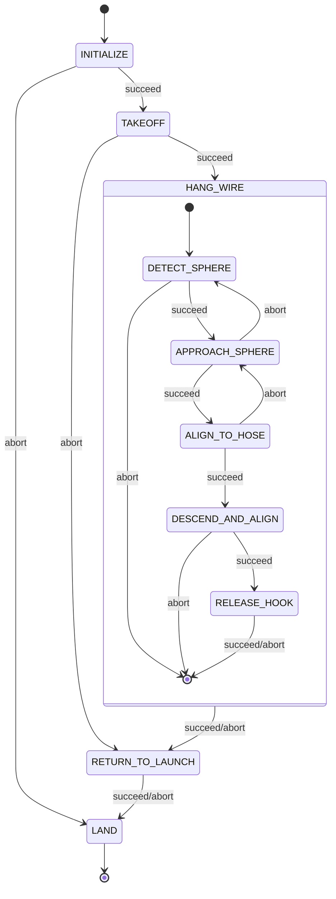

# Hook - SAE Eletroquad 2026 Mission 2

ROS 2 package for the "Hang the Right Wire" mission. The drone takes off from the center of a 7m-diameter arena, identifies which of two ropes has the orange sphere, flies to that rope, hangs a hook via servo, and returns to land.

Built with [Nectar SDK](https://github.com/Black-Bee-Drones/nectar-sdk) and [Yasmin](https://github.com/uleroboticsgroup/yasmin) state machines.

## Hardware

- **Drone**: Custom quadrotor with ArduPilot (GPS-based pose)
- **Camera**: Arducam 2MP IMX662 Ultra Low Light USB (102deg diagonal FOV, 1920x1080)
- **Compute**: Jetson Orin Nano
- **Hook mechanism**: Servo motor (AUX 3)

## Strategy

Two-phase approach based on what each sensor can see at each altitude:

**Phase A -- Sphere-guided (6m to 3.5m):** The hose is ~6px wide at 6m, invisible to any model. The sphere (25cm) is ~112px, easily detectable. Use sphere detection to navigate near the correct hose and descend to working altitude. The drone intentionally stops slightly offset from the sphere (not directly above) to prevent the TFLuna lidar from reading the sphere surface instead of the ground. The lidar remains the primary altitude source throughout the mission; the protection is spatial (avoid overflying the sphere), not by switching sensors.

**Phase B -- Hose-guided (3.5m to 2.0m):** At 3.5m the hose is ~14-20px, viable for segmentation. Extract the hose angle from the segmentation mask via `cv2.minAreaRect` (same technique as the SDK's `RotatedRect` line estimation). Align yaw perpendicular to the hose, center above it, descend while maintaining alignment.

## State Machine



### States

| State | File | Description |
|-------|------|-------------|
| INITIALIZE | `core/states.py` | Create drone (DroneFactory/MAVROS), camera (ImageHandler/USB), load detection + segmentation models |
| TAKEOFF | `core/states.py` | Arm, set home, take off to search altitude (6m) |
| DETECT_SPHERE | `states/detect_sphere.py` | Detect orange sphere from altitude with yaw scan if needed |
| APPROACH_SPHERE | `states/approach_sphere.py` | Step 1: PID center near sphere at search alt (offset to avoid lidar). Step 2: descend to 3.5m with lateral tracking |
| ALIGN_TO_HOSE | `states/align_to_hose.py` | Segmentation mask + minAreaRect to get hose angle; PID yaw to perpendicular, PID center above hose |
| DESCEND_AND_ALIGN | `states/descend.py` | Descend with dual PID: center_x -> vy (stay above hose) + angle -> vyaw (stay perpendicular) |
| RELEASE_HOOK | `states/release_hook.py` | Servo actuation to release hook |
| RETURN_TO_LAUNCH | `core/states.py` | Navigate back to takeoff position |
| LAND | `core/states.py` | Land and cleanup |

## Package Structure

```
hook/
  hook/
    mangalarga.py           # Top-level state machine + entry point
    core/
      constants.py          # All tunable parameters
      states.py             # Initialize, Takeoff, ReturnToLaunch, Land
    states/
      sm.py                 # HangWireSM sub-state machine
      detect_sphere.py      # Phase A: sphere detection from altitude
      approach_sphere.py    # Phase A: center + descend using sphere
      align_to_hose.py      # Phase B: yaw alignment + centering on hose via segmentation
      descend.py            # Phase B: descent with hose alignment
      release_hook.py       # Servo release
  share/models/             # Place model weights here
  package.xml
  setup.py
```

## Models

Place trained model weights in `share/models/`:
- `sphere.pt` -- YOLO detection model for the orange sphere
- `rope_seg.pt` -- YOLO-seg (or similar) instance segmentation model for the hose

Models are accessed at runtime via `ament_index_python.packages.get_package_share_directory("hook")`.

## Parameters

Key parameters in `hook/core/constants.py`:

| Parameter | Default | Description |
|-----------|---------|-------------|
| `SEARCH_ALTITUDE` | 6.0 m | Takeoff/search height |
| `WORK_ALTITUDE` | 3.5 m | Transition from sphere to hose guidance |
| `RELEASE_ALTITUDE` | 2.0 m | Height to release hook (hose is at 1.7m) |
| `RTL_ALTITUDE` | 5.0 m | Safe return altitude |
| `HOSE_ANGLE_TOLERANCE_DEG` | 5.0 | Degrees from perpendicular to consider aligned |
| `HOSE_CENTER_TOLERANCE_PX` | 40 | Pixel tolerance for centering above hose |
| `SPHERE_OFFSET_PX` | 120 | Pixel offset to avoid flying directly over sphere (lidar protection) |
| `DESCEND_VELOCITY` | 0.1 m/s | Descent rate |
| `SERVO_CHANNEL` | 3 | AUX output for hook servo |

## Usage

```bash
cd ~/ros2_ws
colcon build --packages-select hook
source install/setup.bash
ros2 run hook mangalarga
```

## Dependencies

- [Nectar SDK](https://github.com/Black-Bee-Drones/nectar-sdk) (control, vision, AI)
- [Yasmin](https://github.com/uleroboticsgroup/yasmin) (state machine)
- ROS 2

## References

- [SAE Eletroquad 2026 Rules](../Regulamento_EletroQuad_2026_portugues.pdf)
- [Mission Notes](../hook.md)
- [Nectar SDK Documentation](https://github.com/Black-Bee-Drones/nectar-sdk/blob/main/README.md)
