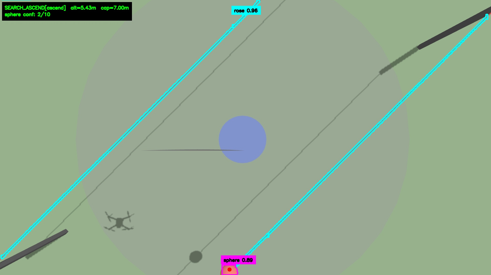
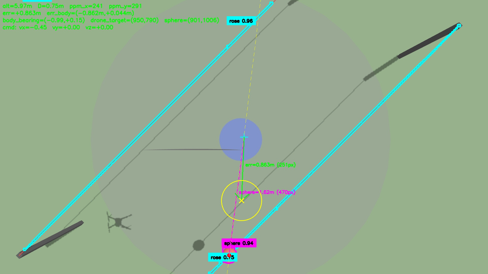
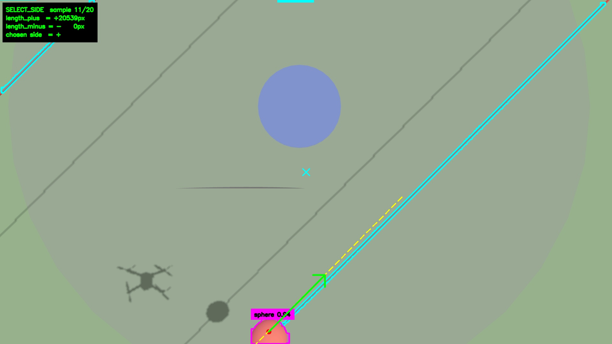
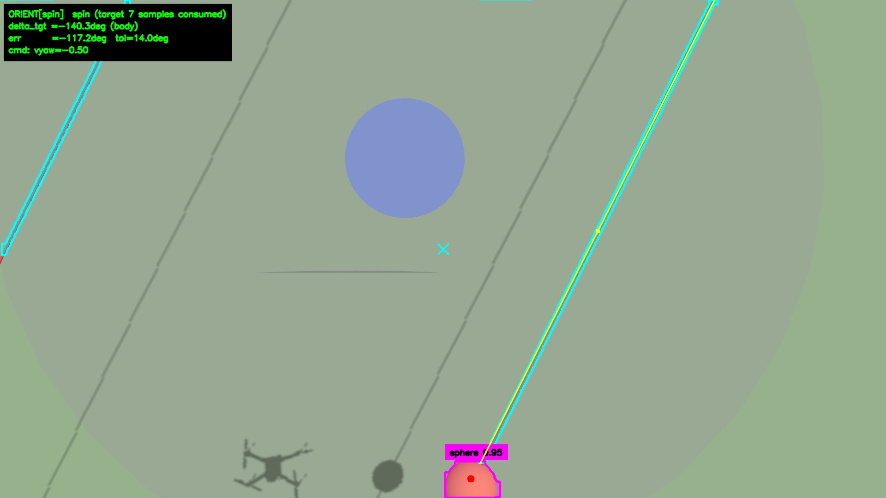
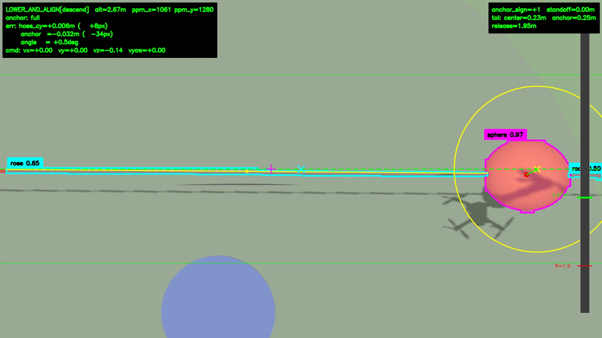
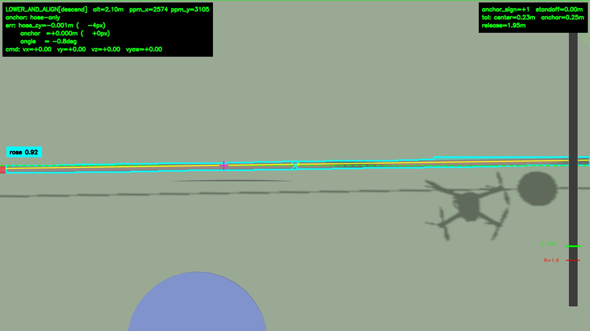

# Execução da Missão M2 — SAE Eletroquad 2026

Guia rápido pra rodar a missão "Hang the Right Wire" na competição.
Detalhes técnicos completos no [README.md](README.md).

## 1. Pré-requisitos (Jetson)

- Workspace buildado e sourceado:
  ```bash
  cd ~/ros2_ws
  colcon build --packages-select hook nectar nectar_interfaces
  source install/setup.bash
  ```
- Alias `mavros_udp` definido em `~/.bash_aliases` (sobe MAVROS APM em UDP 14552).
- Pesos do modelo presentes em `share/models/`. Jetson usa `.engine` (TensorRT). v2 do modelo será publicado depois.

## 2. Execução — Drone Real

Três terminais, na ordem abaixo.

### Terminal 1 — LIDAR (TFLuna, TTL)

```bash
ros2 run nectar rangefinder_node.py --ros-args \
    -p serial_port:=/dev/ttyUSB0 \
    -p mavlink_url:=udp:127.0.0.1:14551 \
    -p filter:=obstacle_mask
```

### Terminal 2 — MAVROS

```bash
mavros_udp
```

Confirmar que o lidar chega no MAVROS **antes** de armar:

```bash
ros2 topic echo /mavros/rangefinder/rangefinder
```

### Terminal 3 — Missão

```bash
ros2 run hook mangalarga
```

Visualização ao vivo (overlay anotado de cada estado):

```bash
ros2 run rqt_image_view rqt_image_view /hook/mission/image
```

or just `rqt`

## 3. Execução — Simulação (Gazebo + SITL)

Parâmetros de controle vêm de
[hook/core/constants_sim.py](hook/core/constants_sim.py) (Kp e velocidades
~4× os do real; drone simulado é lento e estável demais). Confirmações,
tolerâncias e geometria continuam idênticos ao real.

```bash
# Terminal 1, na pasta nectar-sdk
make sim-start-gazebo

# Terminal 2
ros2 launch hook sae_hook.launch.py drone_yaw_deg:=45 sphere_x:=-1.5 sphere_y:=-1.25

# Terminal 3
HOOK_SIM=1 ros2 run hook mangalarga
```

`drone_yaw_deg`, `sphere_x`, `sphere_y` ajustam a pose inicial.
Z da esfera é fixo em 1.7m.

## 4. Parâmetros principais por estado

Todos em [hook/core/constants.py](hook/core/constants.py). Listadas
abaixo só as variáveis que valem mexer entre tentativas; o resto raramente
precisa.

### Geral

| Variável | Valor / Comentário |
|---|---|
| `SPHERE_HEIGHT_M` | 1.7 — altura real da esfera/corda. |
| `CAMERA_SCALING_METHOD` | `"fov"` (validado no real). `"intrinsic"` tende a ser mais preciso depois da calibração de câmera. |
| `SEG_MODEL_PATH` | Caminho do modelo (`.engine` TensorRT na Jetson). |

### SEARCH_ASCEND — sobe até detectar a esfera



Sobe até confirmar `ASCENT_STOP_CONFIRMATIONS` frames consecutivos com
esfera. Se bater `MAX_ASCEND_ALTITUDE` sem confirmar, **para de subir e
gira em yaw** até detectar (ou estourar `ASCENT_TIMEOUT`).

| Variável | Recomendação |
|---|---|
| `INITIAL_TAKEOFF_ALTITUDE` | ~4.5m — já decola em altura útil, evita gastar tempo subindo do zero. |
| `MAX_ASCEND_ALTITUDE` | Teto da subida antes do yaw-search. |
| `ASCENT_STOP_CONFIRMATIONS` | 5–10. |
| `ASCEND_YAW_RATE_RAD_S` | Velocidade do yaw-search no teto. |

### APPROACH — vai pra perto da esfera



Duas fases: (1) alinha lateralmente na altitude do search, (2) desce
mantendo o alvo até `WORK_ALTITUDE`. Tolerância folgada por design,
estável em testes reais.

| Variável | Recomendação |
|---|---|
| `APPROACH_TARGET_DISTANCE_M` | 0.75 — distância parada do gancho à esfera. |
| `WORK_ALTITUDE` | 3.2–4.2m. **Recomendado: 4.0m** — modelo está confiável e altura maior dá margem pra não perder a hose nos estados seguintes. |

### SELECT_SIDE — escolhe o lado da hose



Sem movimento — só decisão. Amostra N frames e escolhe o lado de corda
mais longo a partir da esfera.

| Variável | Recomendação |
|---|---|
| `SIDE_SAMPLE_FRAMES` | 5–10 (menor = mais rápido). |

### ORIENT_TO_HOOK — gira pro lado certo



Calcula a menor rotação de yaw que deixa a corda perpendicular **e** na
frente do drone. Tolerância de skip alta de propósito — só dispara
rotação quando a correção é grande (ex.: 180°). Ajuste fino fica pro
LOWER_AND_ALIGN.

| Variável | Recomendação |
|---|---|
| `ORIENT_SKIP_THRESHOLD_RAD` | Quando o `|Δ|` previsto está abaixo disso, pula a rotação. |

### LOWER_AND_ALIGN — mais importante




Três fases internas:

1. **`yaw`** — só gira até a corda ficar próxima de horizontal na imagem.
2. **`align`** — PIDs em `(vx, vy, vyaw)`, `vz = 0`. Drone parado no
   stand-off: corda `ALIGN_STANDOFF_M` à frente do gancho (mantém o lidar
   fora da corda), esfera ancorada lateralmente a
   `SPHERE_ANCHOR_DISTANCE_M`.
3. **`descend`** — mesmos PIDs, `vz` proporcional desce o drone,
   `standoff` rampa pra 0. Quando a esfera sai do enquadramento, controle
   cai pro modo "hose-only" (`vy = 0`, só a corda).

**Liberação do gancho** dispara quando todos abaixo simultaneamente por
`DESCEND_RELEASE_CONFIRMATIONS` frames:

- `|altitude − RELEASE_ALTITUDE| ≤ RELEASE_ALTITUDE_TOLERANCE_M`
- `|err_angle| ≤ HOSE_ANGLE_TOLERANCE_DEG`
- `|err_x| ≤ HOSE_CENTER_TOLERANCE_M`
- `|err_y| ≤ SPHERE_ANCHOR_TOLERANCE_M`

**Proteções automáticas**:

- Se o drone cai abaixo da banda de release → `vz` positivo sobe de volta
  pra banda. Nunca aceita altitude baixa demais.
- Se perde a corda escolhida por `LOWER_RECOVERY_LOST_FRAMES` frames →
  sobe (climb-recovery) pra alargar o FOV e recuperar a detecção.
- Se perde por `LOWER_MAX_LOST_FRAMES` frames → aborta.
- Perder só a esfera (corda ainda visível) **não** aborta — segue em
  modo hose-only.

| Variável | Recomendação |
|---|---|
| `RELEASE_ALTITUDE` | `SPHERE_HEIGHT_M + 0.30–0.50m` (~2.0–2.2m com esfera a 1.7m). Controla a folga do gancho sobre a corda. |
| `RELEASE_ALTITUDE_TOLERANCE_M` | 0.15m — banda simétrica em torno do release. |
| `ALIGN_STANDOFF_M` | Offset frontal inicial pra não passar o lidar acima da corda. |
| `SPHERE_ANCHOR_DISTANCE_M` | Distância lateral em que a esfera fica ancorada na fase `align`. |
| `HOSE_ANGLE_TOLERANCE_DEG` / `HOSE_CENTER_TOLERANCE_M` / `SPHERE_ANCHOR_TOLERANCE_M` | Tolerâncias finais pra liberar. |
| `LOWER_RECOVERY_LOST_FRAMES` | Limiar pra iniciar climb-recovery. |
| `LOWER_MAX_LOST_FRAMES` | Limiar pra abortar. |

## 5. Verificações rápidas se algo der errado

| Sintoma | Onde olhar |
|---|---|
| `/mavros/rangefinder/rangefinder` sem dado | LIDAR não iniciou. Cheque Terminal 1 e conexão |
| Drone não arma / não decola | MAVROS desconectado. `ros2 topic echo /mavros/state` — deve ter `connected: true` e `mode: GUIDED`. |
| `/hook/mission/image` sem frame | Câmera ou modelo. Cheque `IMAGE_SOURCE` em constants.py e o caminho do `.engine`. ou só delay de comunicação |
| SEARCH_ASCEND aborta no teto | Esfera fora do FOV mesmo depois do yaw-search. Confirme orientação inicial e posição da esfera. Aumentar `ASCENT_TIMEOUT` dá mais tempo. |
| APPROACH oscila ao parar | `APPROACH_TOL_M` muito apertado, ou ruído MAVROS acima de `PID_MIN_OUTPUT_VELOCITY_XY`. |
| LOWER_AND_ALIGN nunca libera | PIDs laterais não convergem dentro da banda de altitude. Afrouxar tolerâncias ou reduzir `DESCEND_VZ_KP` (passa mais tempo na banda). |
| Drone sobe sem motivo no descend | Climb-recovery ativou — corda escolhida ficou muitos frames sem detecção. Cheque modelo / camera / luz. |
| Missão aborta cedo em quedas de detecção | Aumentar `APPROACH_MAX_LOST_FRAMES` / `LOWER_MAX_LOST_FRAMES`. |

### Rodar só um trecho da missão (debug)

`mangalarga` aceita um prefixo de estados — útil pra isolar problema:

```bash
ros2 run hook mangalarga --list                                # ordem dos estados
ros2 run hook mangalarga --stages search_ascend --end land     # 1 estado, pousa
ros2 run hook mangalarga --stages search_ascend,approach,select_side --end none
```

`--end none` deixa o drone parado no fim do último estado executado, útil
pra inspecionar a convergência sem RTL/LAND no caminho.
